# Отчет по лабораторной работе: Настройка виртуальной машины

### 1. Параметры виртуальной машины
#### 01-vm-settings.png
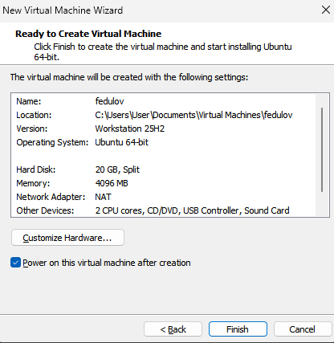

### 2. Консоль виртуальной машины
#### 02-vm-console.png

### 3. Информация о системе
#### 03-system-info.png

### 4. IP-адрес
#### 04-ip-addr.png
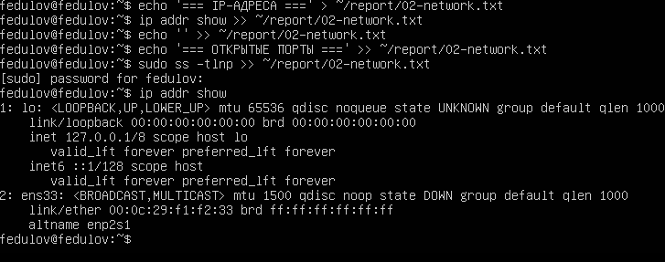

### 5. Открытые порты
#### 05-ports.png
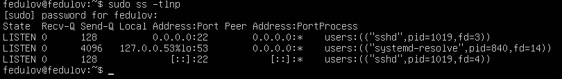

### 6. Статус SSH
#### 06-ssh-status.png
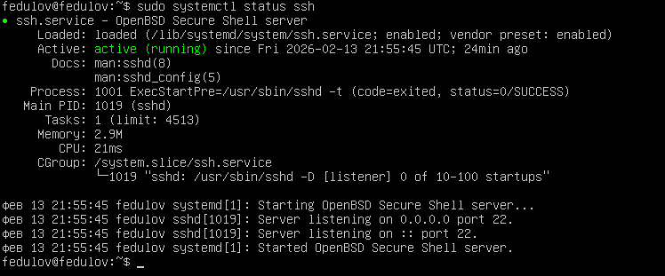

### 7. Порт SSH
#### 07-ssh-port.png
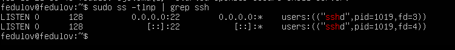

### 8. Список пользователей
#### 08-users.png
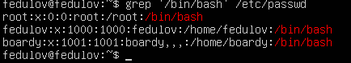

### 9. Создание нового пользователя
#### 09-new-user and 10-user-check.png

### 10. Содержимое корня (/)
#### 11-root-tree.png
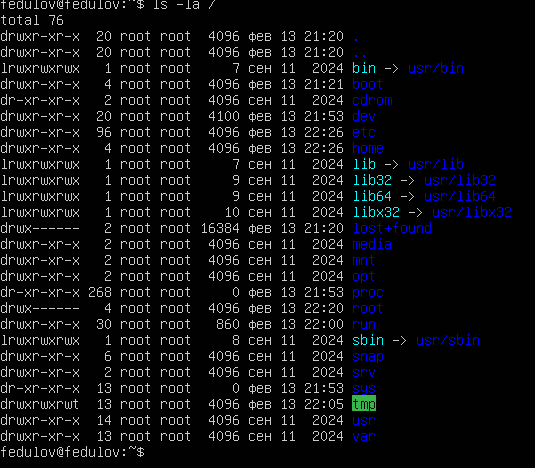

### 11. Домашняя директория
#### 12-home-tree.png
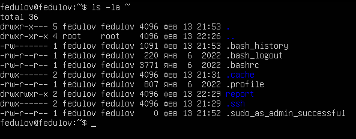

### 12. Права доступа
#### 13-permissions.png
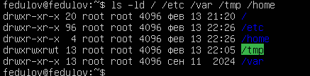

### 13. Изменение прав (chmod)
#### 14-chmod.png
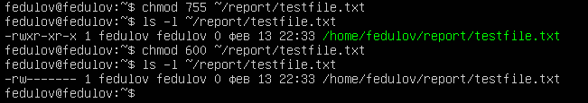

### 14. Установленные пакеты
#### 15-packages.png
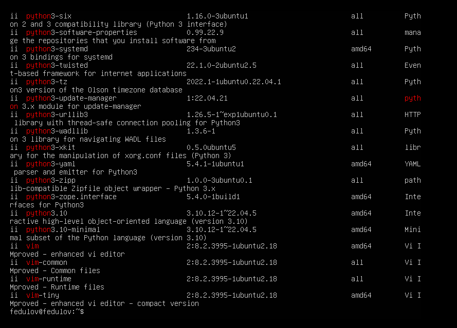

### 15. Запущенные сервисы
#### 16-services.png

### 16. Топ процессов
#### 17-top-processes.png
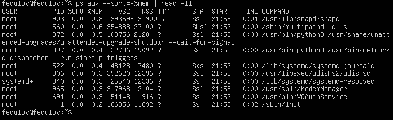

### 17. Количество процессов
#### 18-process-count.png
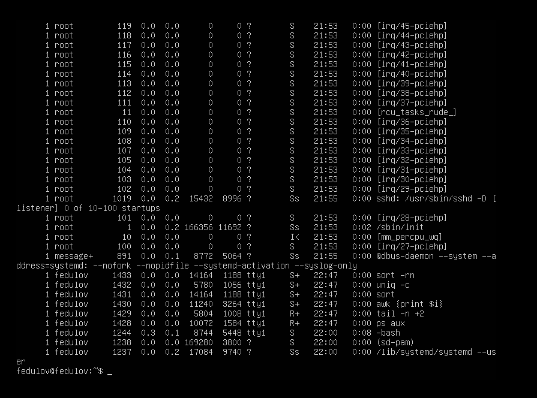

### 18. Крупные файлы
#### 19-big-files.png
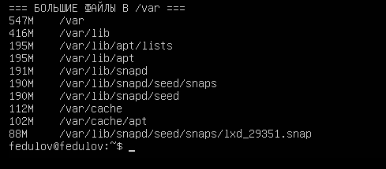

### 19. Файлы отчета
#### 20-report-files.png
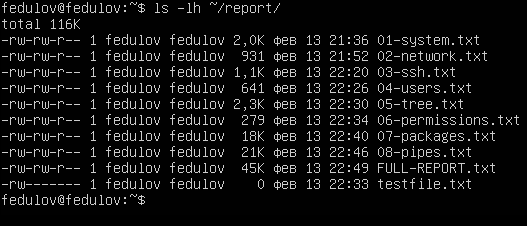

