# Отчет по лабораторной работе 

## Часть A. Подготовка и вёрстка

### Задание 1. Столбец password_hash

#### 01-describe.png
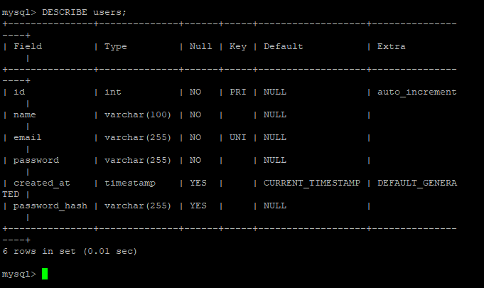

> **Вопрос:** Почему VARCHAR(255), а не VARCHAR(60)? Что бы произошло если сделать VARCHAR(50)?
>
> **Ответ:** `[Хэш, который генерирует функция (password_hash(), занимает 60 символов. Но завтра hash функция может обновиться и хэш станет длиннее)]`

---

### Задание 2. Partials
#### 02-nav-guest.png
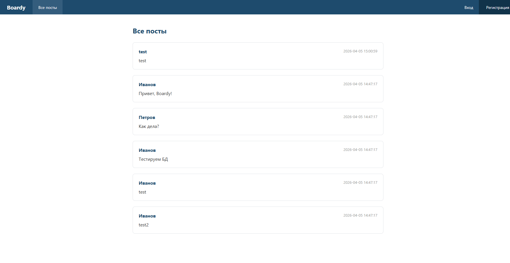

#### 03-nav-logged.png
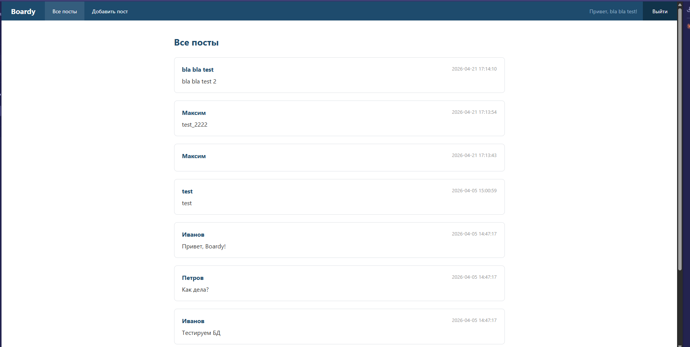

> **Вопрос:** Почему меню вынесено в отдельный файл? Что изменится если добавить новую ссылку — например, «Избранное»?
>
> **Ответ:** `[Это позволяет не дублировать код. Также разделяем логику на файлы, чтоб можно было удобно редактировать. Соблюдаем принцип DRY]`

---

### Задание 3. Вёрстка форм

#### 04-register-layout.png
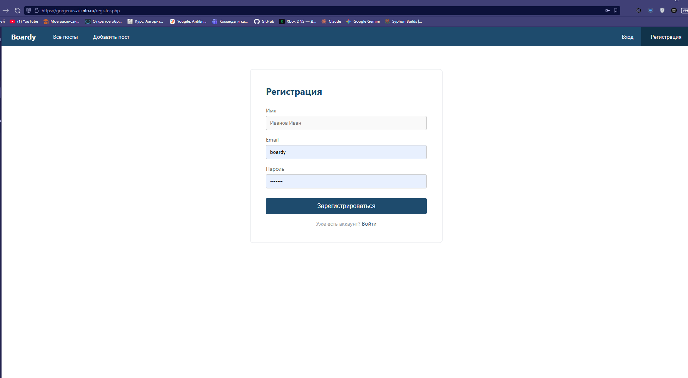

#### 05-login-layout.png
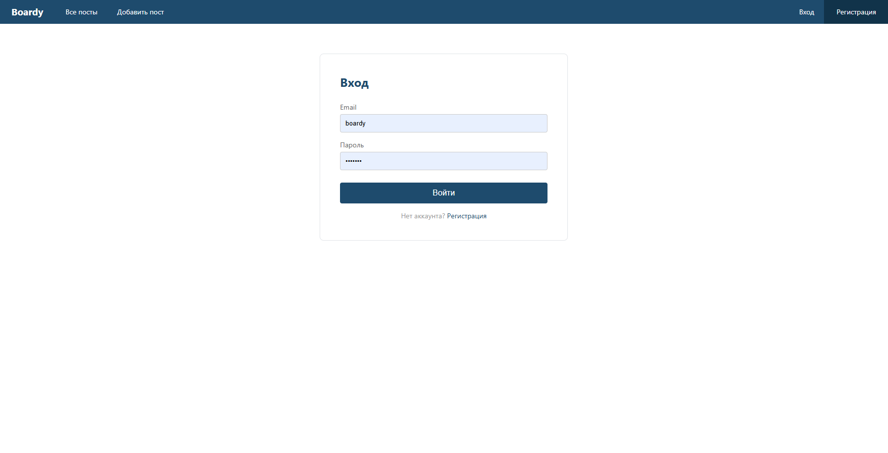

---

## Часть B. Регистрация и логин

### Задание 4 и 5. Регистрация и хеш

#### 06-register-done.png
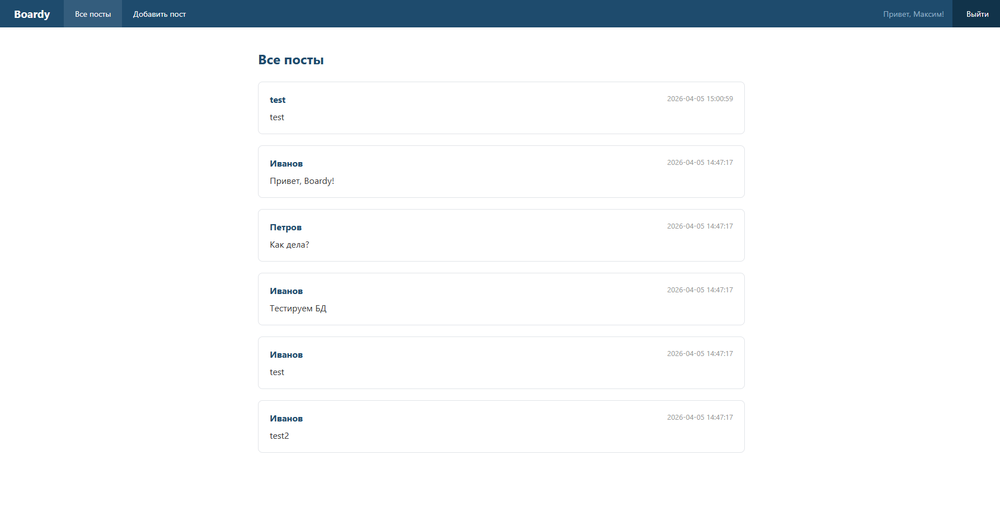

#### 07-hash.png
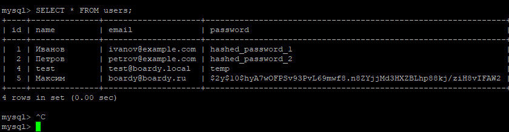

> **Вопрос:** Объясните структуру хеша $2y$10$Kx8QnZq... — что означает каждая часть?
>
> **Ответ:** `[алгоритм ($2y$ = bcrypt), cost factor (10), соль, хеш.]`

> **Вопрос:** Что произойдёт если cost factor увеличить с 10 до 15?
>
> **Ответ:** `[Чем выше число, тем больше времени понадобится серверу на расчет хеша, что делает перебор пароля тяжелее]`

---

### Задание 6. Защита от повторной регистрации

#### 08-email-taken.png
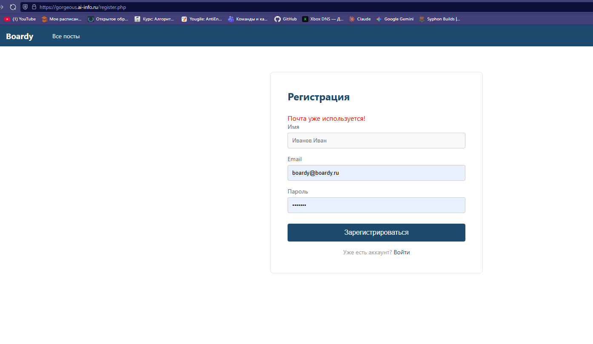

> **Вопрос:** Зачем проверять email перед INSERT? Что произойдёт без этой проверки?
>
> **Ответ:** `[Может произойти дублирование записей. 2 пользователя с одним email.]`

---

### Задание 7 и 8. Логин

#### 09-login-done.png
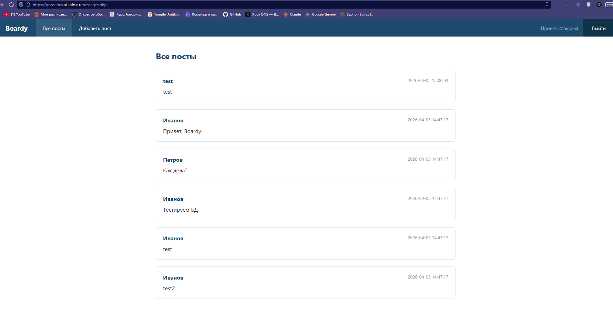

#### 10-wrong-password.png
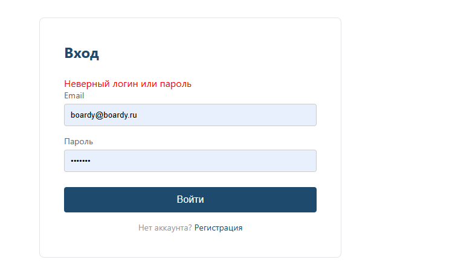

> **Вопрос:** Почему сообщение одинаковое и для "email не найден", и для "неверный пароль"?
>
> **Ответ:** `[Защитная мера против перебора имени пользователя]`

---

## Часть C. Куки и сессии

### Задание 9, 10 и 11. Параметры куки

#### 11-cookie.png
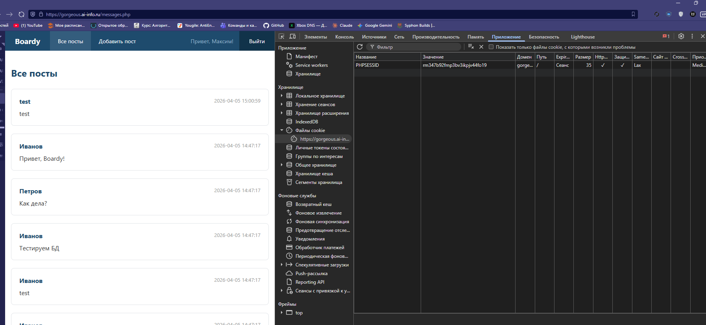

#### 12-cookie-attrs.png
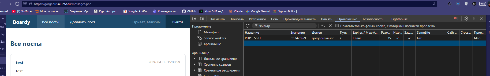

#### 13-httponly-check.png
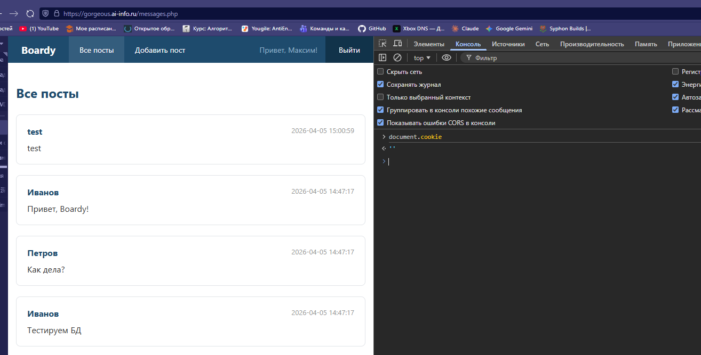

> **Вопрос:** Что хранится в значении куки? Это пароль, имя пользователя, что-то ещё? Откуда берётся значение?
>
> **Ответ:** `[В ней хранится только случайный индентификатор сессии. ]`

> **Вопрос:** Что изменится если убрать HttpOnly? Как это можно использовать в XSS-атаке?
>
> **Ответ:** `[Если его убрать, то кука становится доступной для чтения через JavaScript. Злоумышленник считывает значение куки и отправляет ID на свой сервер. Потом подставляет ID в свой браузер и входит в аккаунт]`

> **Вопрос:** Почему PHPSESSID не видна JavaScript, хотя кука существует?
>
> **Ответ:** `[Благодря флагу HttpOnly]`

---

### Задание 12. Файл сессии на сервере

#### 14-session-file.png
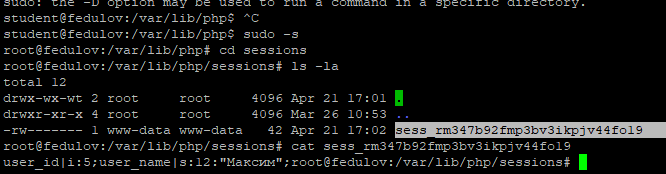

> **Вопрос:** Что хранится в файле на сервере? Сравните с тем, что в куке. Почему данные разделены так?
>
> **Ответ:** `[В файле на сервере хранится полезная информация: id пользователя, имя, уровень прав и все, что мы положим в $_SESSION. А в куке хранится только ID сессии.
> Данные так разделены для безопасности, чтоб нельзя было поменять user_id или попасть в чужой аккаунт. ]`

---

## Часть D. Защита и доработка

### Задание 13. Защита страниц

#### 15-redirect.png
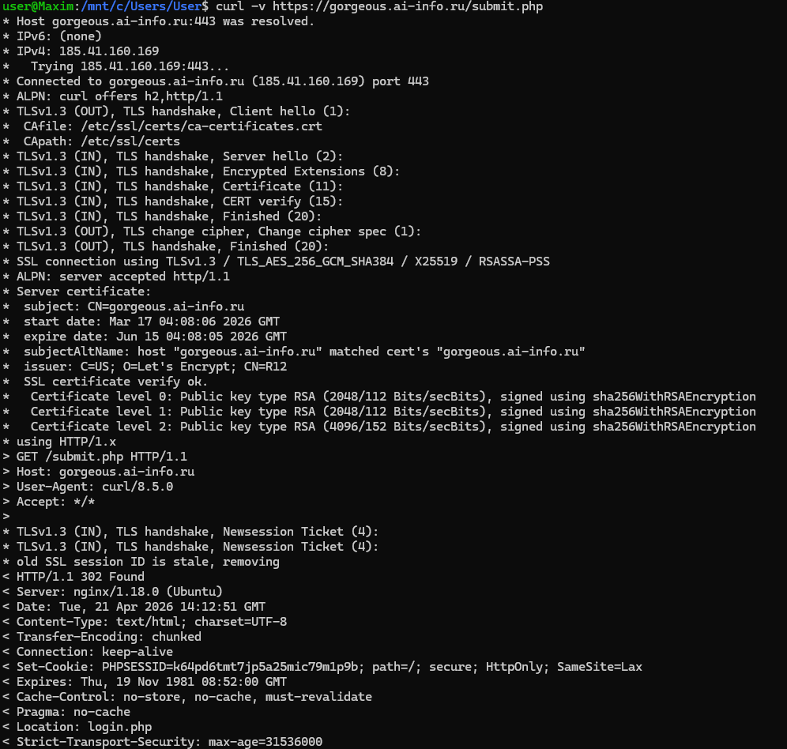

---

### Задание 14 и 15. Посты с авторами

#### 16-posts-authors.png
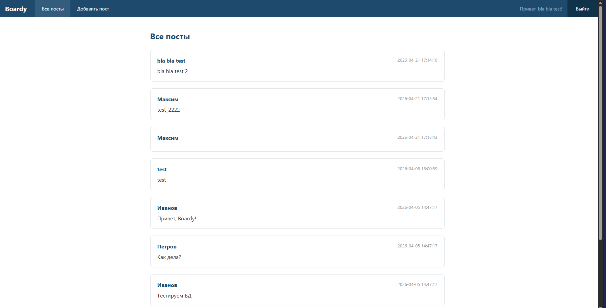

#### 17-submit-layout.png
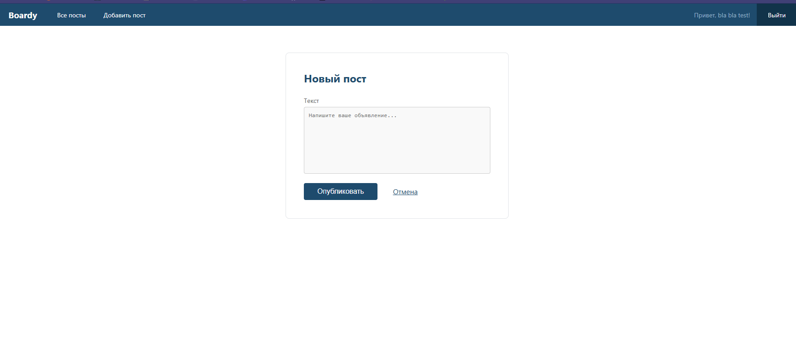

> **Вопрос:** Напишите SQL с JOIN, которым вы тянете посты. Почему JOIN, а не два отдельных запроса?
>
> **Ответ:**
> ```sql
> SELECT posts.body, users.name, posts.created_at
> FROM posts
> JOIN users ON posts.author_id = users.id
> ORDER BY posts.created_at DESC
> ```
> `[JOIN нужен для производительности (объединение за один запрос).]`

---

### Задание 16 и 17. Logout и истёкшая сессия

#### 18-after-logout.png
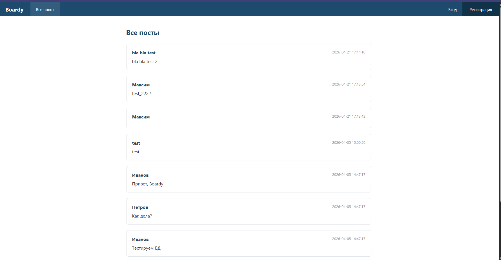

#### 19-cookie-gone.png
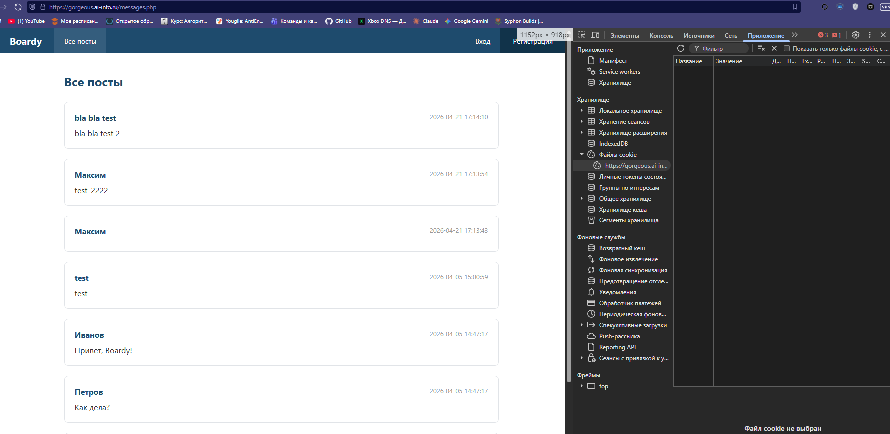

#### 20-expired.png
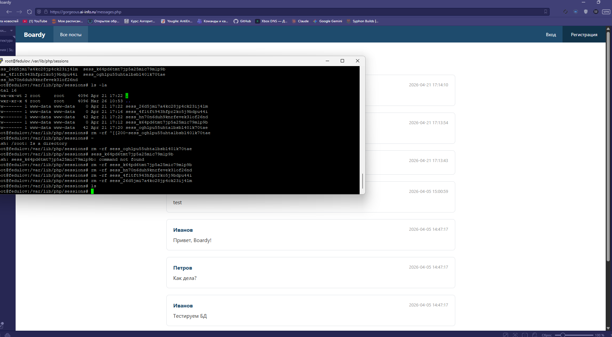

> **Вопрос:** Что делает session_destroy()? Зачем ещё и setcookie() с прошедшей датой?
>
> **Ответ:** `[session_destroy() - удаляет файл на сервере. setcookie() с прошедшей датой - удаляет куку]`

> **Вопрос:** Почему браузер считает себя залогиненным (есть кука), а сервер — нет?
>
> **Ответ:** `[Сервер может удалить файл сессии, а бразуер об этом не знает и продолжает отправлять куку с ID. ]`