# Отчет по лабораторной работе №11: JWT для API и OAuth через GitHub

### Часть A. JWT для API

### 1. Доступ к API без токена
#### 01-no-token.png
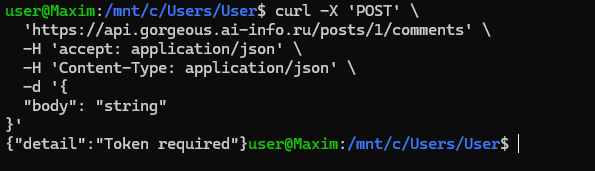
> **Ответ на вопрос:** Заголовок `Bearer` указывает на схему аутентификации. Использование этого префикса позволяет серверу понять, какой механизм проверки используется. 
> Без него серверу было бы не понятно, является ли строка в `Authorization` токеном, паролем или чем-то другим.

### 2. Получение JWT через me.php
#### 02-me-php.png
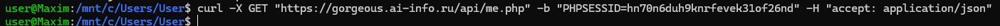
> **Ответ на вопрос:** `me.php` использует `session_start()`, потому что пользователь уже авторизован в браузере через PHP-сессию. 
> Кука `PHPSESSID` служит ключом к этой сессии на стороне сервера, позволяя идентифицировать пользователя и выдать ему персональный JWT для работы с API.

### 3. Получение JWT в React
#### 03-console-jwt.png
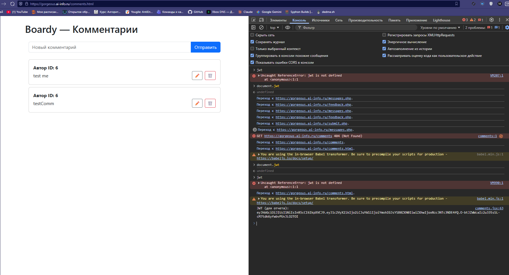

### 4. Передача Bearer в заголовках
#### 04-bearer-header.png
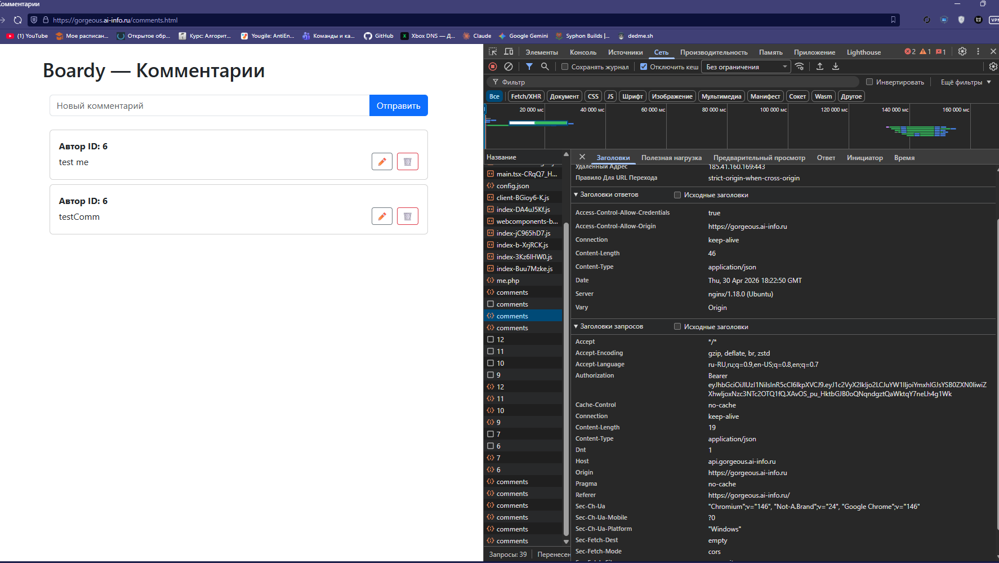

### 5. Анализ токена на jwt.io
#### 06-jwt-io.png
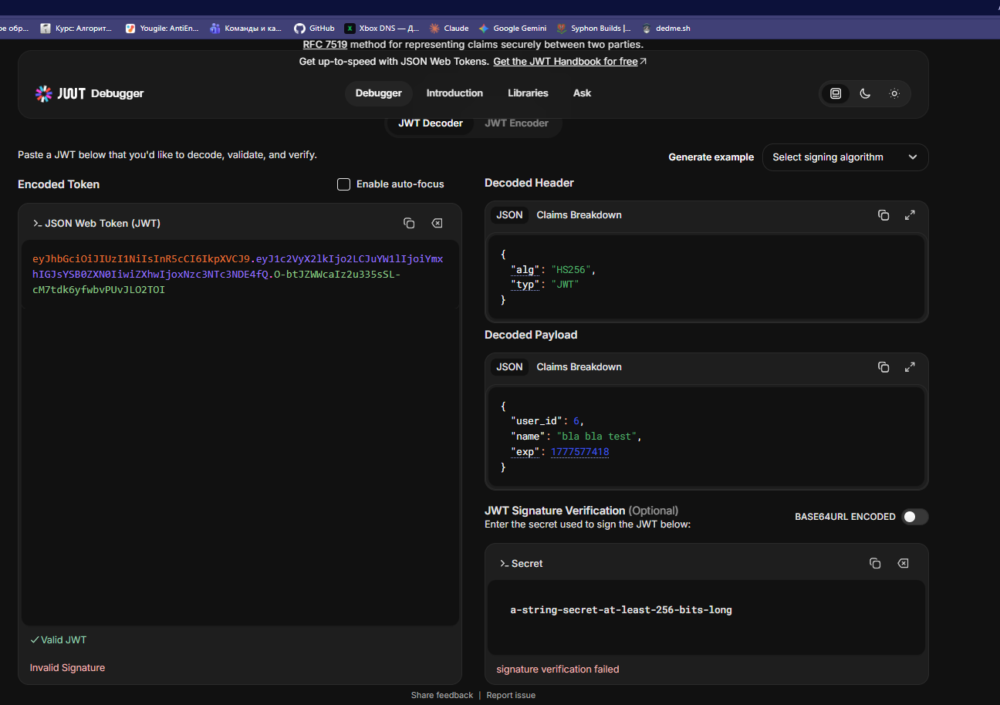
> **Ответ на вопрос:** Данные в Payload закодированы (Base64), а не зашифрованы. Злоумышленник увидит всё содержимое (ID пользователя, email и т.д.). 
> Это не является проблемой, так как JWT предназначен для проверки подлинности данных через подпись, а не для их скрытия. Секретные данные в Payload передавать нельзя.

### 6. Истёкший токен
#### 07-expired.png
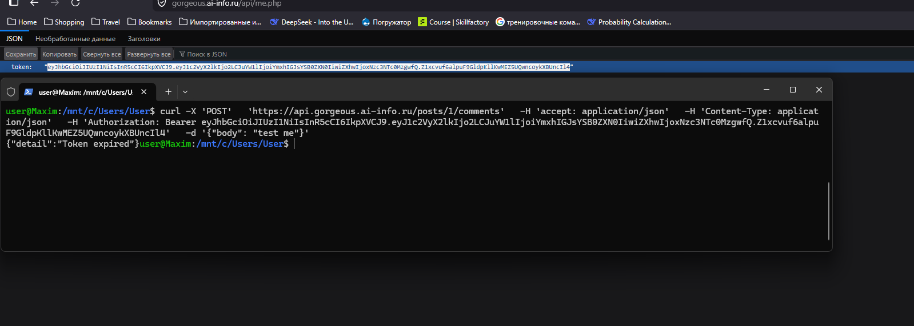

### 7. Невалидный токен
#### 08-invalid.png
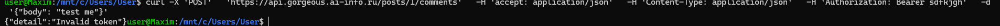

---

### Часть B. OAuth через GitHub

### 8. Регистрация OAuth App
#### 09-github-app.png
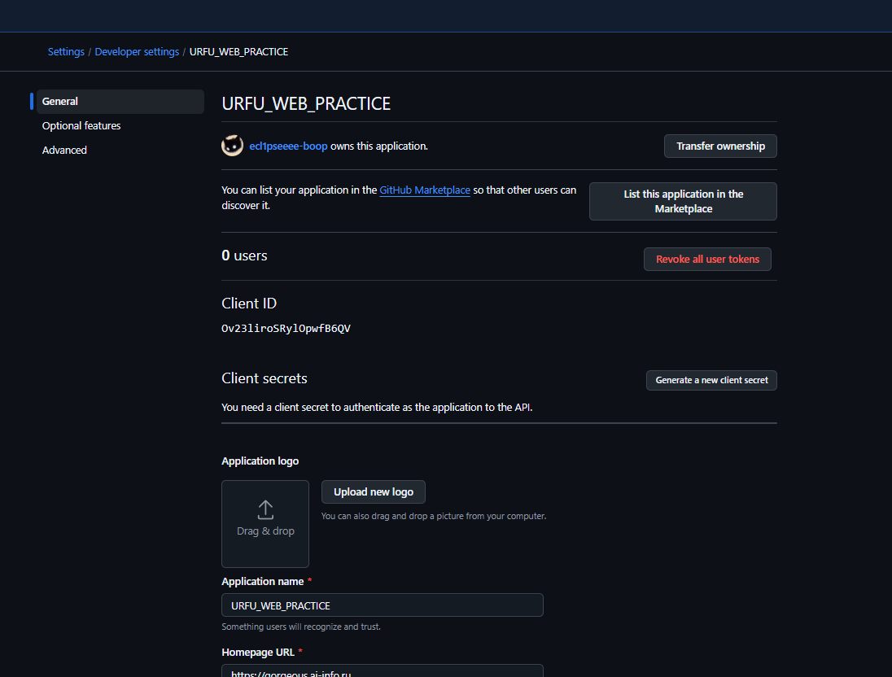

### 9. Структура таблицы пользователей
#### 10-describe.png
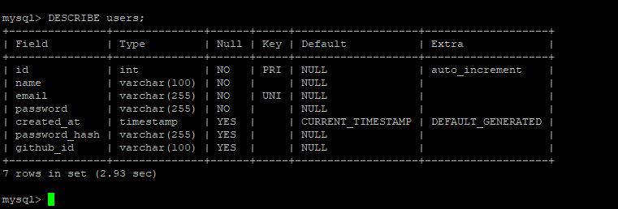

### 10. Кнопка входа
#### 11-login-button.png
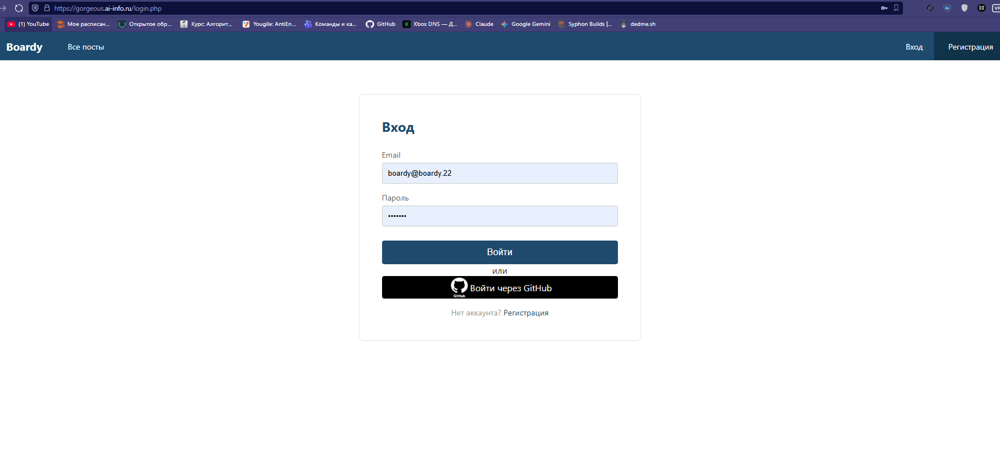

### 11. Процесс авторизации
#### 12-github-authorize.png
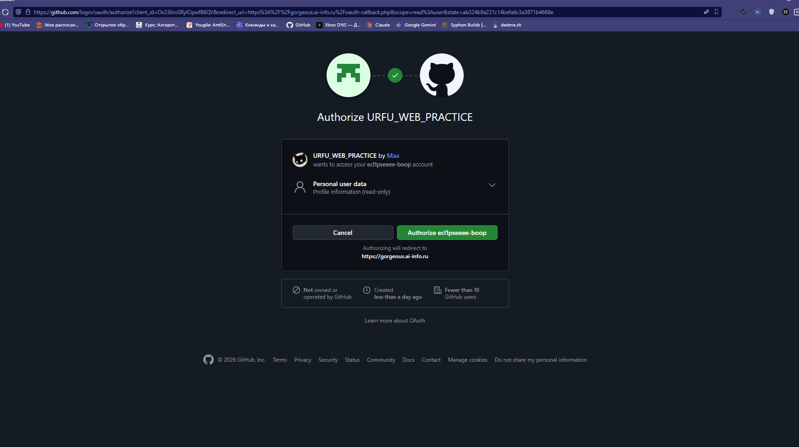

#### 13-oauth-logged.png
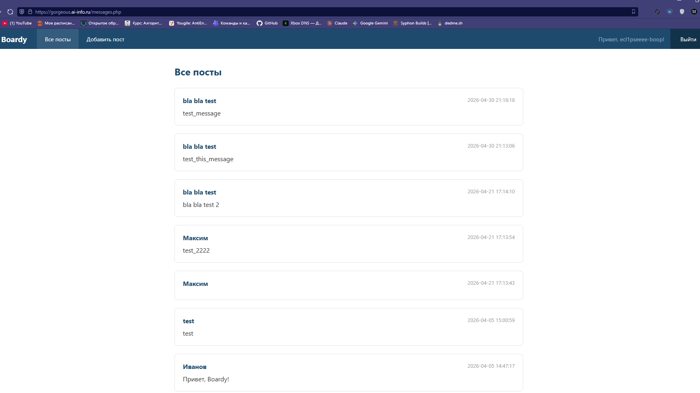

### 12. Пользователь в БД
#### 14-github-user.png
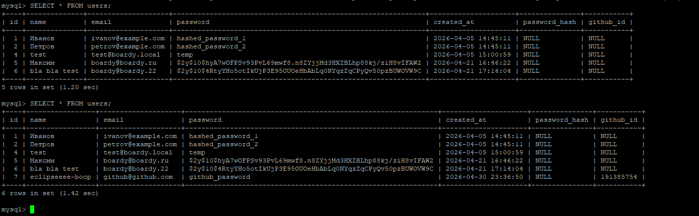
> **Ответ на вопрос:** Мы ищем пользователя по `github_id`, так как это уникальный и неизменный идентификатор в системе GitHub. 
> Email пользователя может измениться или быть скрыт настройками приватности, что сделает невозможным повторный вход, если опираться только на почту.

### 13. Работа API через OAuth
#### 15-oauth-comment.png
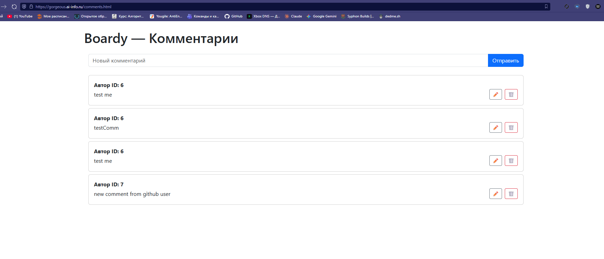

**Полный flow авторизации и запроса:**
Кнопка «Войти через GitHub» → Перенаправление на GitHub → Подтверждение доступа пользователем → Callback на наш сервер с кодом → Обмен кода на Access Token GitHub → 
Получение данных профиля → Создание/поиск пользователя в БД → Установка PHP-сессии → Запрос к `me.php` → 
Получение JWT → Сохранение JWT в React → Fetch запрос к FastAPI с заголовком `Authorization: Bearer <token>` → Проверка токена в `auth.py` → Создание комментария.

### 14. Безопасность (параметр state)
> **Ответ на вопрос:** `state` — это случайная строка, используемая для защиты от CSRF-атак.
**Сценарий атаки без state:**
1. Атакующий начинает процесс входа через GitHub на своем аккаунте.
2. Он перехватывает URL с `code` (callback) до того, как его браузер его использует.
3. Атакующий заставляет жертву (например, через скрытую картинку или ссылку) перейти по этому URL.
4. Сайт жертвы принимает код и привязывает GitHub-аккаунт атакующего к профилю жертвы.
5. Теперь атакующий может войти в аккаунт жертвы, просто авторизовавшись через свой GitHub.

---

### Часть C. Анализ

### 15. Все способы входа
#### 16-three-users.png
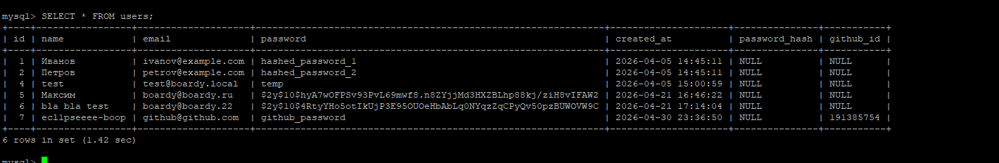

### 16. Сравнение механизмов
| Вопрос | Куки+сессии | JWT | OAuth |
| :--- | :--- | :--- | :--- |
| **Где хранятся данные?** | На сервере (файлы/БД) | У клиента (в токене) | У провайдера (GitHub) |
| **Кто прикрепляет к запросу?** | Браузер (автоматически) | JS-код (вручную) | JS-код (вручную) |
| **Для какого типа клиентов?** | Обычные веб-сайты | SPA, мобильные приложения | Сторонние сервисы |
| **Можно ли отозвать?** | Да (удалить из БД) | Сложно (нужны Blacklists) | Да (в настройках GitHub) |
| **Кросс-доменно?** | Нет (SameSite/CORS) | Да | Да |

### 17. Баги и пакеты Laravel
> **Анализ багов текущей реализации:**
1. **Отсутствие Refresh Tokens:** В нашем коде, если токен истек, пользователь просто теряет доступ. Пакет **Laravel Sanctum** решает это через автоматическое управление временем жизни сессий и токенов.
2. **Безопасное хранение секрета:** Сейчас секрет для подписи JWT часто хранится прямо в коде. Пакет **dotenv** (интегрирован в Laravel) позволяет вынести его в переменные окружения, защищая от попадания в репозиторий.
3. **Обработка ошибок OAuth:** Наш код может упасть при ошибке сети с GitHub. Пакет **Laravel Socialite** берет на себя всю сложную логику обработки исключений и стандартизацию данных профиля.