# Отчет по лабораторной работе

## ЧАСТЬ A. FastAPI: WebSocket

### 1. ConnectionManager
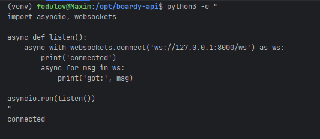

1. Почему список подключений хранится в памяти, а не в БД?
WebSocket — это активное сетевое соединение (TCP). Он привязан к конкретному процессу в операционной системе. Хранить такую штуку в БД - физически невозможно.
Рассылка должна происходить за наносекунды, а работа с БД может быть очень долгой.

2. Что произойдет при перезапуске Uvicorn?
Память процесса очистится и список подключений станет пустым.
Все TCP-сокеты со стороны сервера принудительно закроются. Браузеры клиентов зафиксируют обрыв соединения.

3. Как это решается в реальных проектах?
В реальных проектах для сохранения стабильности используется брокер Redis (паттерн Pub/Sub). Он работает в оперативной памяти и с его помощью сообщения пересылаются, а на фронтенде настраивается логика автоматического переподключения при обрыве сокета.

### 2. /internal/broadcast
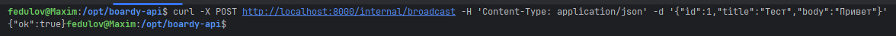

1. Почему не требуется JWT-авторизация?
JWT-токены используются для аутентификации внешних пользователей. Запросы на /internal/broadcast отправляет не человек из браузера, а сам бэкенд. 
Передавать и проверять пользовательский JWT в межсерверном взаимодействии архитектурно избыточно и нецелесообразно.

2. Какой риск остается без авторизации?
Если эндпоинт оставить полностью открытым, любой внешний злоумышленник сможет отправить прямой HTTP-запрос и заспамить или подменить JSON-данные в веб-сокетах всех подключенных пользователей.

3. Как этот риск закрывает Nginx?
Ограничение на уровне сетевого уровня (IP-фильтрация): Защита реализуется на веб-сервере Nginx с помощью директив allow и deny в блоке конфигурации:
```nginx
location /internal {
allow 127.0.0.1; # Разрешить запросы только с локального сервера
deny all;       # Заблокировать всех остальных из внешнего мира
}
```
Nginx проверяет IP-адрес источника запроса до того, как передать его в FastAPI. Любая внешняя попытка обратиться к этому роуту мгновенно отсекается веб-сервером с возвратом стандартного сетевого статуса 403 Forbidden.

### 3. Два клиента
Показал на 2-х скриншотах, потому что не получилось уместить на одном скриншоте 2 терминала
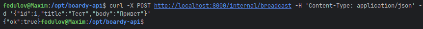
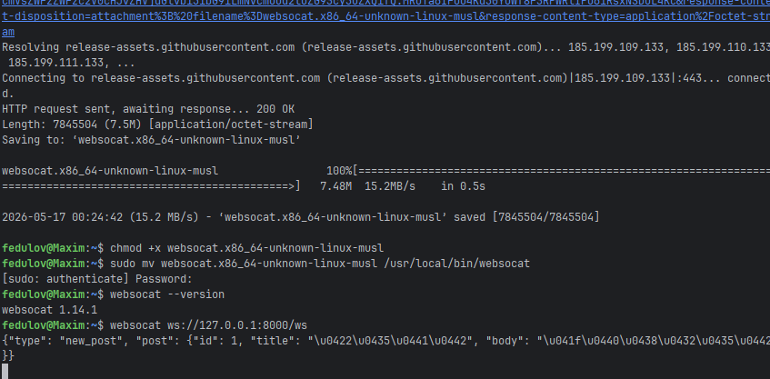

1. Что произойдет, если один из клиентов отключился во время рассылки?
Процесс отправки сообщений остальным (активным) клиентам не прервется.
При попытке отправить данные на уже закрытый сокет отключившегося клиента, сервер выбросит исключение.
Но мы встроили защиту в коде, поэтому сервер проигнорирует ошибку и продолжит рассылку для всех оставшихся участников. Клиент просто будет исключен из списка при следующем цикле или по событию disconnect.

2. Где в коде это обрабатывается?
Этот сценарий обрабатывается в файле ws.py внутри метода broadcast класса ConnectionManager с помощью конструкции try ... except:
```python
    async def broadcast(self, message: dict):
        import json
        dead_connections = []
        for ws in self.active:
            try:
                await ws.send_text(json.dumps(message))
            except:
                dead_connections.append(ws)

        for ws in dead_connections:
            self.active.remove(ws)
```

## ЧАСТЬ B. Laravel: HTTP-callback

### 4. PostController
Для тестирования я создал 3 поста.
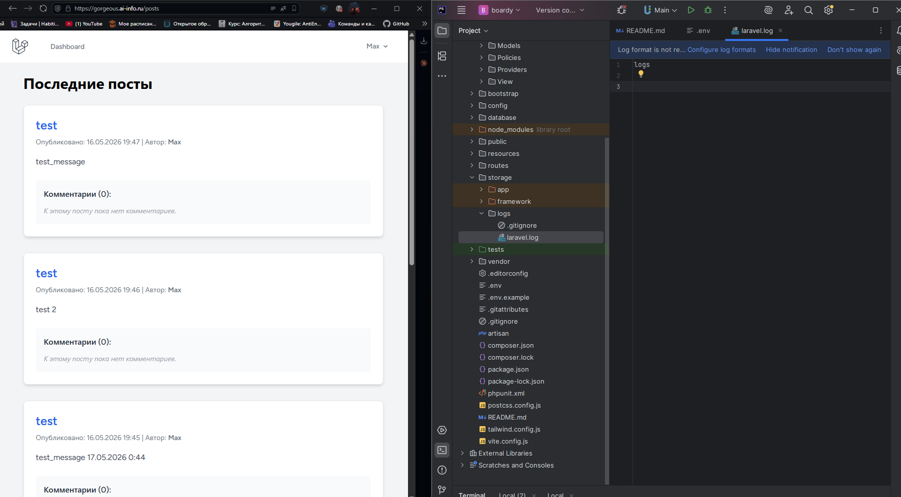

1. Зачем нужен timeout(2)?

Метод timeout(2) устанавливает максимальное время ожидания ответа от FastAPI. 
Если за это время FastAPI не ответит, Laravel принудительно прервет соединение и выбросит исключение,
которое нужно обработать, чтобы ошибка внешнего сервиса не ломала основную логику приложения.

2. Что случится, если FastAPI недоступен, а timeout не указан?
По умолчанию HTTP-клиент Laravel имеет очень длительный дефолтный таймаут (около 30 секунд). 
Если сервер FastAPI "упадет" или начнет зависать, Laravel-бэкенд будет послушно ждать ответа все эти 30 секунд намертво заблокировав текущий поток PHP-FPM.

Когда несколько пользователей одновременно создадут посты, все доступные воркеры PHP-FPM быстро окажутся заняты вечным ожиданием ответа от упавшего FastAPI. 
В результате весь ваш сайт перестанет отвечать на любые запросы других пользователей, 
выдавая ошибку 504, хотя база данных и сам Laravel будут полностью исправны.

### 5. Проверка callback
Вот FastAPI обработал все 3 поста, которые я создал для тестирования.
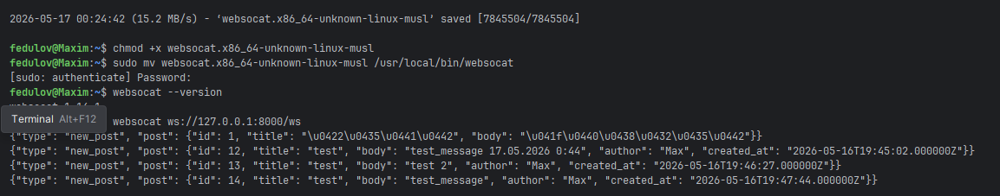

Использование прямого синхронного HTTP-запроса из основного бэкенда к микросервису FastAPI для рассылки веб-сокетов является антипаттерном.
Проблемы этой архитектуры:
1. Синхронность и блокировка основного потока
   При создании поста пользователь вынужден ждать не только сохранения записи в базу данных, но и завершения HTTP-запроса до FastAPI. Если FastAPI начнет отвечать медленно, время ответа для конечного пользователя сильно увеличится.

2. Критическая уязвимость к падению сервисов
   Система обладает высокой связанностью. Если микросервис FastAPI полностью «упадет» или уйдет на перезагрузку, Laravel начнет сыпать ошибками при каждой попытке создания поста. Нет отказоустойчивости.

3. Отсутствие гарантии доставки и буферизации
   Если в момент отправки HTTP-запроса сеть пропадет на мгновение, событие будет безвозвратно утеряно. Нет механизма повторных попыток или очереди для сохранения событий. 


## ЧАСТЬ C. JS клиент

### 6. WebSocket в Blade
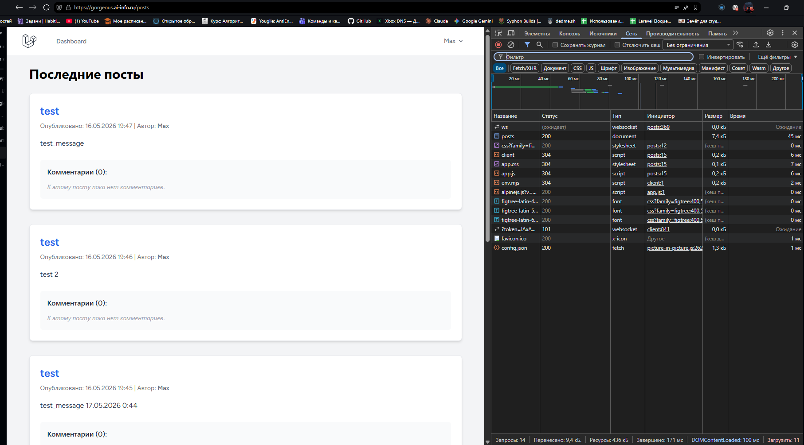

ws:// (WebSocket) — это незащищенный протокол (что-то типо HTTP). Используется на локальном компьютере, так как трафик не выходит в сеть и его некому перехватить.
wss:// (WebSocket Secure) — это защищенный протокол (что-то типо HTTPS). Он шифрует данные с помощью TLS/SSL-сертификата. 

Что произойдёт, если использовать wss:// без TLS?
Ошибка рукопожатия: Соединение вообще не установится. Браузер попытается инициировать защищенное TLS-соединение, но так как на сервере (в Nginx) не настроены SSL-сертификаты для этого порта, сервер не сможет расшифровать приветственный пакет и сбросит запрос.


### 7. Два браузера
Я создал 2 поста для каждого скриншота и показал их работу.
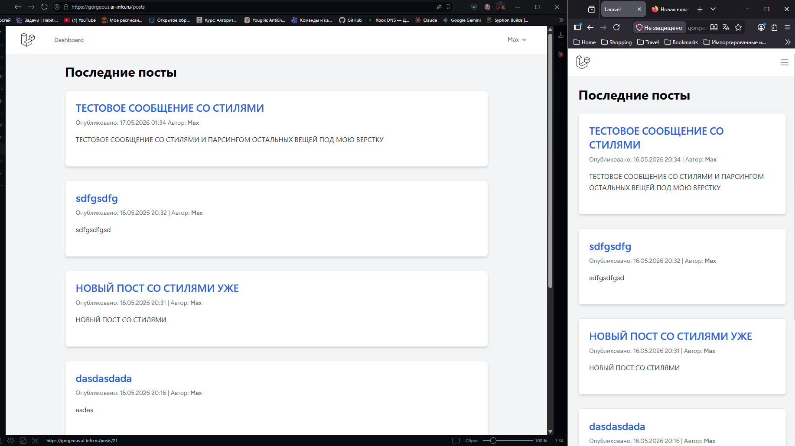
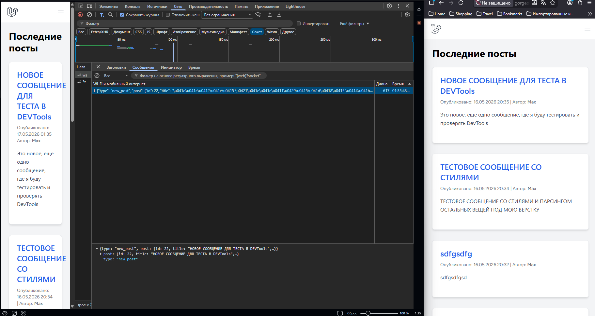

### 8. XSS
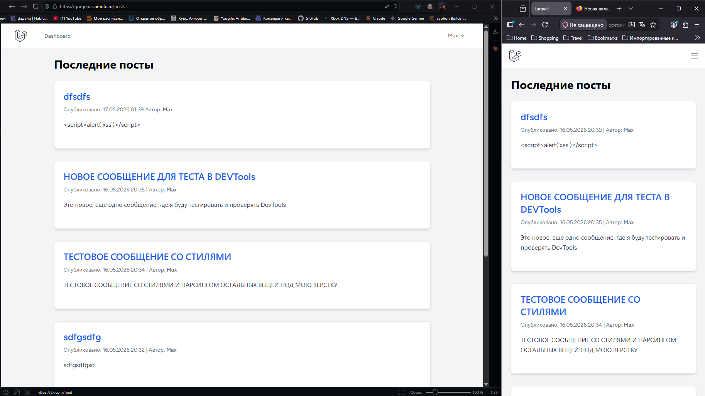

Функция escapeHtml() превращает опасные спецсимволы HTML в их безопасные текстовые эквиваленты (HTML-сущности):

< заменяется на &lt;
> заменяется на &gt;
& заменяется на &amp;
" заменяется на &quot;

В результате браузер не воспринимает строку <script> как команду для запуска кода, а просто отображает её на странице как обычный текст. В шаблонизаторе Blade это экранирование происходит автоматически.

Что случится, если вставить данные напрямую в innerHTML без экранирования?
Уязвимость Stored XSS: Браузер послушно распарсит строку как реальный HTML-код и выполнит вредоносный скрипт.
Потеря данных и сессий: Злоумышленник сможет написать скрипт, который украдет чужие localStorage, токены авторизации или сессионные куки (document.cookie) и отправит их на свой сервер.
Кража аккаунтов: От имени пострадавшего пользователя скрипт сможет выполнять любые действия на сайте — например, менять пароль или слать спам.

### 9. Переподключение
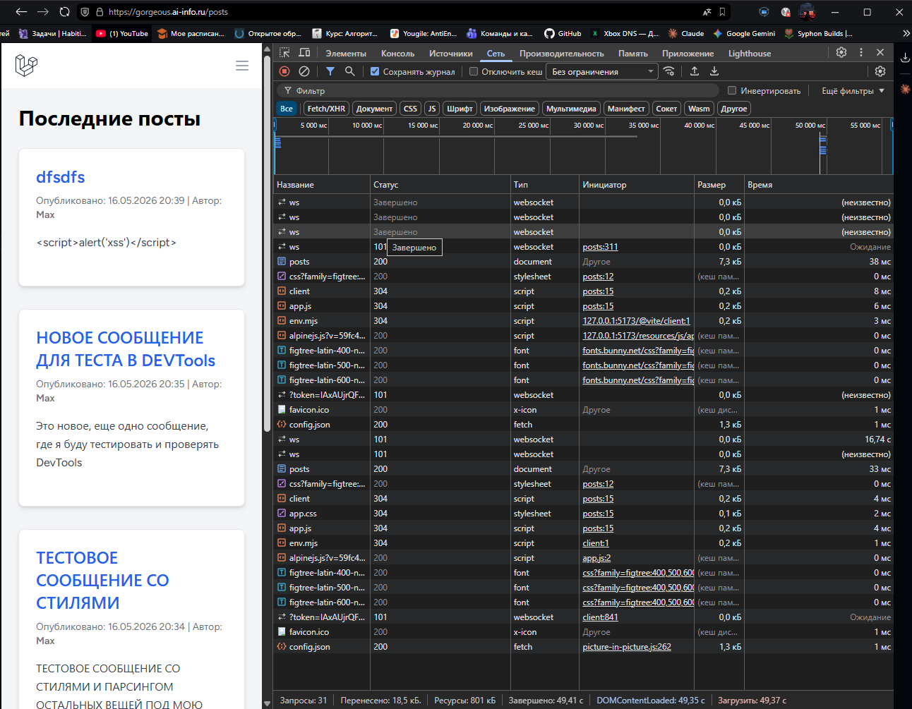


## ЧАСТЬ D. Nginx

### 10. WS-проксирование
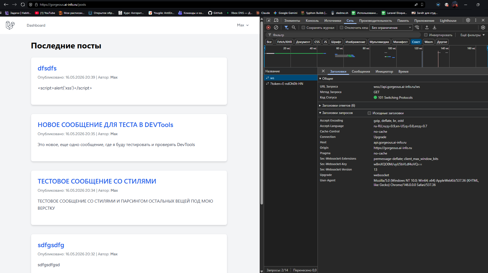

1. Если убрать proxy_http_version 1.1;
Соединение WebSocket вообще не установится. По умолчанию Nginx использует протокол HTTP/1.0 для проксирования на бэкенд. 
Однако протокол WebSocket требует обязательного использования HTTP/1.1, так как только в этой версии поддерживается механизм смены протокола (Upgrade). FastAPI/Uvicorn сразу вернет ошибку.

2. Если убрать proxy_set_header Upgrade $http_upgrade; (и Connection)
Сервер вернет стандартный HTTP-ответ вместо перехода на веб-сокеты (400 ошибка, или 101 не произойдет).
Nginx по умолчанию не передает заголовки Upgrade и Connection на бэкенд. Без них FastAPI не узнает, что клиент пришел не за обычной веб-страницей, а хочет переключить текущее соединение на постоянный WebSocket-канал.

3. Если убрать proxy_read_timeout 86400;
Веб-сокеты будут постоянно закрываться сами по себе каждые 60 секунд, если в канале нет активности.
Дефолтный таймаут ожидания данных в Nginx составляет 60 секунд. 
Если пользователь открыл страницу и в течение минуты сервер не прислал ему новое уведомление, Nginx посчитает соединение заброшенным и принудительно разорвет TCP-дрейф. 
Значение 86400 выставляет этот таймаут на 24 часа.

### 11. Закрыть /internal
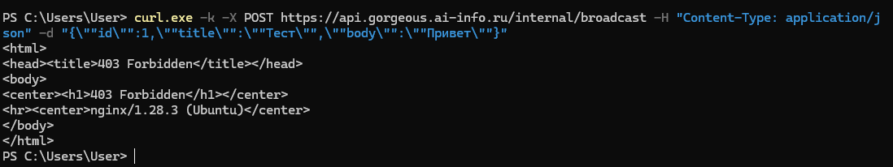

1. Почему /internal/broadcast опасен без ограничения доступа?
Без ограничения доступа этот эндпоинт становится публично доступной дверью в систему.
1. Злоумышленник может отправить на этот URL любой JSON-пакет, и WebSocket-сервер послушно транслирует его всем подключенным пользователям.
2. Через поддельные события на фронтенд можно транслировать фейковые системные уведомления, фишинговые ссылки, спам или вредоносный код.
3. Отсутствие лимитов позволяет засыпать эндпоинт миллиардами тяжелых запросов, что мгновенно перегрузит процессор и оперативную память сервера, обрушив WebSocket-демон.

2. Кто мог бы его вызвать?
В случае открытого доступа вызвать этот эндпоинт может любой субъект, находящийся вне вашей доверенной зоны:
1. Хакеры, сканирующие сеть
2. Конкуренты или спам-боты: Автоматизированные скрипты, которые используют уязвимость для рассылки рекламы или намеренного ухудшения работы вашего сервиса.
3. Случайные пользователи: Любой человек, открывший инструменты разработчика в браузере, подсмотревший структуру запросов и решивший ради шутки отправить аналогичный POST-запрос через curl или Postman со своего ПК.

Ограничение allow 127.0.0.1; deny all; в Nginx гарантирует, что вызвать этот роут сможет только само серверное приложение (например, ваш Laravel-бэкенд, запущенный на той же машине), а любые запросы «извне» будут заблокированы на сетевом уровне со статусом 403 Forbidden.

