# Отчёт по практике №14: Финальная микросервисная архитектура

---

## Часть A. Passport как OAuth 2.1 сервер

### Задание 1. Установка и SPA-клиент
Выполнена установка Laravel Passport и создан публичный SPA-клиент с поддержкой PKCE.

#### 01-passport-install.png
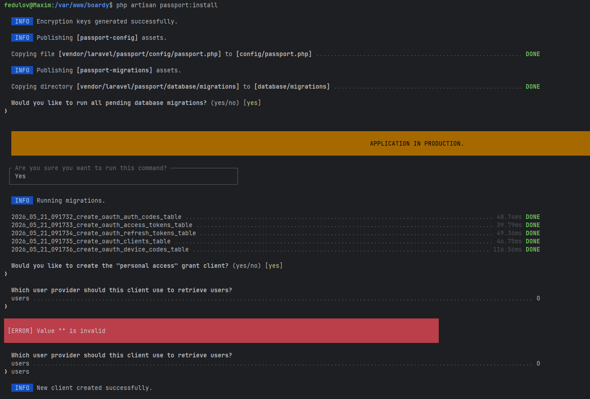

Тут произошла ошибка и client id показался не сразу, поэтому я вывел его в следующем скриншоте
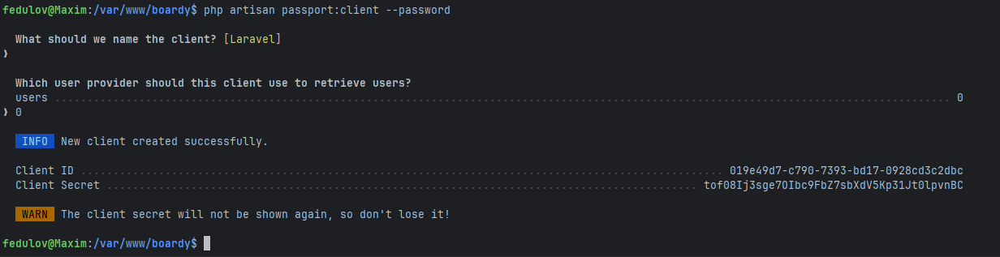

#### 02-spa-client.png
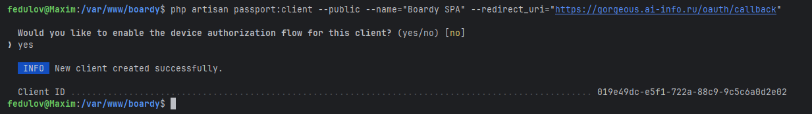

> **Вопрос:** Почему публичный клиент без secret? Чем PKCE заменяет client_secret и от какой атаки защищает?
>
> **Ответ:** *[Напиши здесь, почему в SPA нельзя безопасно хранить secret, как code_challenge и code_verifier защищают от перехвата авторизационного кода (Authorization Code Interception Attack)]*

---

### Задание 2. TTL и refresh
В `AuthServiceProvider` настроены сроки жизни токенов: access-токен (15 минут), refresh-токен (30 дней).

#### 03-token-ttl.png
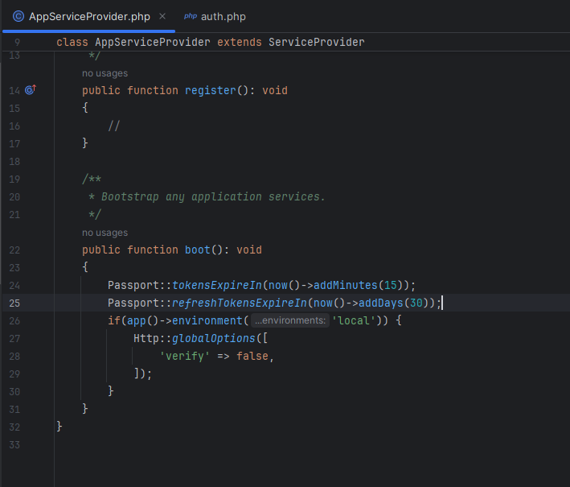

> **Вопрос:** Почему access короткий, а refresh длинный? Что произойдёт если access будет 24 часа?
>
> **Ответ:** *[Опиши здесь риски компрометации access-токена и роль refresh-токена в поддержании сессии без постоянного ввода логина/пароля]*

---

### Задание 3. Проверка выдачи через curl
Вручную сгенерированы `code_verifier` и `code_challenge`. Успешно пройден flow получения авторизационного кода и его обмена на токены через консоль.

#### 04-pkce-curl.png
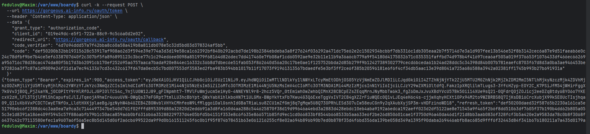

> **Вопрос:** Какие шаги OAuth flow прошёл этот curl-запрос?
>
> **Ответ:** *[Перечисли шаги: запрос к /oauth/authorize с challenge -> получение code -> POST-запрос к /oauth/token с verifier -> выдача JWT]*

---

## Часть Б. Две базы данных

### Задание 4. Создание boardy_api
Выделена отдельная база данных `boardy_api` для сервиса FastAPI, куда была перенесена таблица `comments`.

#### 05-databases.png
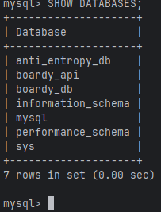

#### 06-comments-schema.png
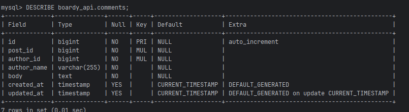

> **Вопрос:** Почему in comments нет FK на posts и users? Что делать с целостностью данных?
>
> **Ответ:** *[Объясни специфику микросервисной архитектуры: базы данных изолированы, внешние ключи между разными БД невозможны. Расскажи про обеспечение целостности на уровне приложений или через паттерны вроде Event Driven]*

### Задание 5. FastAPI подключён к новой БД
Конфигурация подключения `DB_CONFIG` в `main.py` перенастроена на новую базу данных.

#### 07-fastapi-db.png
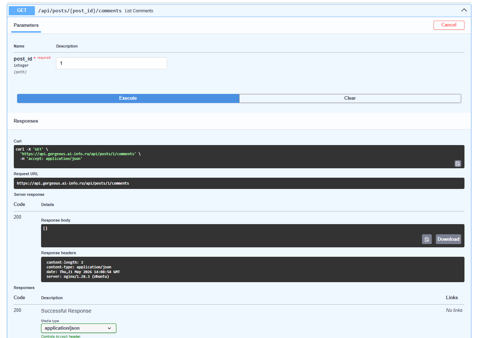

---

## Часть В. FastAPI: RS256 + полный CRUD

### Задание 6. RS256 проверка
В данном задании я добавил авторизацию для метода GET, чтоб можно было протестировать работу и понять, как оно работает. В дальнейшем этот токен я уберу из кода и GET запрос можно будет сделать без токена. Исключительно в целях удобства и понимания работы!
Сервис авторизации переведён на асимметричный алгоритм RS256. В FastAPI добавлен публичный ключ Passport для проверки подписи JWT.

#### 08-rs256-success.png
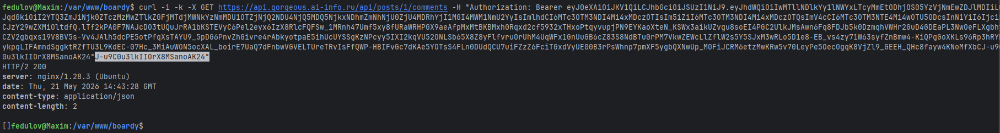

#### 09-rs256-fail.png
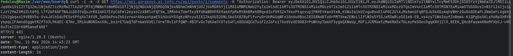

> **Вопрос:** Почему RS256 безопаснее HS256 для распределённых систем?
>
> **Ответ:** *[Поясни, что при RS256 закрытый ключ для подписи знает только сервер авторизации, а микросервисы проверяют подпись публичным ключом, что исключает утечку секретного ключа]*

---

### Задание 7. Полный CRUD с author_name
Для полного CRUD я написал скрипт. В скриншоте показал результаты выполнения. До этого создал много постов, так как были ошибки с PUT/DELETE, которые я чинил некоторое время.
Реализованы эндпоинты для полноценного управления комментариями. Поле `author_name` передаётся в теле запроса (payload) для денормализации.

#### 10-crud-all.png
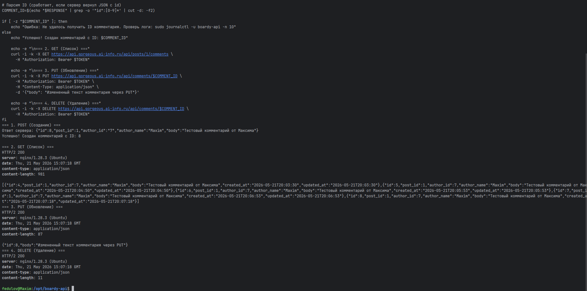

> **Вопрос:** Почему author_name передаётся в payload запроса, а не извлекается из токена? Что было бы если зашить в JWT custom claim?
>
> **Ответ:** *[Напиши про денормализацию и то, что имя пользователя может меняться, а токен хранит статичные данные на момент выдачи. Также упомяни раздувание размера JWT при использовании слишком больших custom claims]*

---

### Задание 8. Owner check
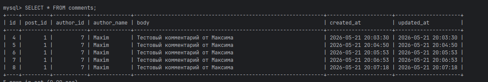
Добавлена проверка прав доступа. Пользователь может редактировать или удалять только свои собственные комментарии.

#### 11-owner-check.png
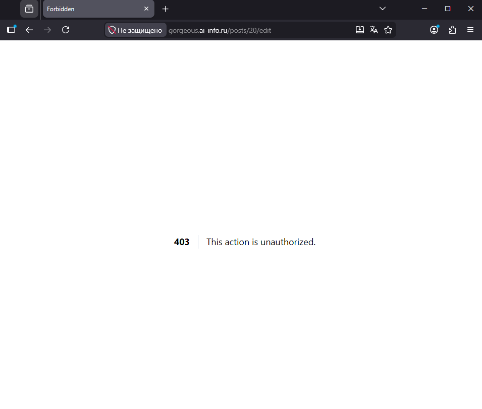

> **Вопрос:** Где в коде проверяется владелец? Что произойдёт если убрать эту проверку?
>
> **Ответ:** *[Укажи на функцию/мидлварь в `routers/comments.py`, где `user_id` из JWT сравнивается с `user_id` автора комментария. Опиши уязвимость IDOR (Insecure Direct Object Reference), которая возникнет без проверки]*

---

### Задание 9. CORS
Настроена политика CORS, ограничивающая доступ к API конкретным доверенным доменом.

#### 12-cors-config.png
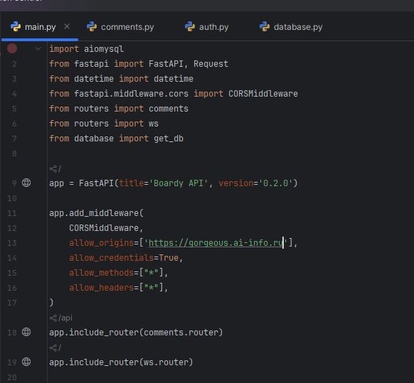

> **Вопрос:** Почему allow_origins=['*'] + credentials=true браузер блокирует? Что произошло бы с куками если бы пропустил?
>
> **Ответ:** *[Объясни требования безопасности спецификации CORS. Если бы браузер это разрешал, любой сторонний вредоносный сайт мог бы делать запросы с куками пользователя]*

---

## Часть Г. React PKCE flow

### Задание 10. PKCE утилиты
На стороне фронтенда реализованы хелперы для генерации криптографических строк `verifier`, `challenge` и `state`.

#### 13-pkce-utils.png
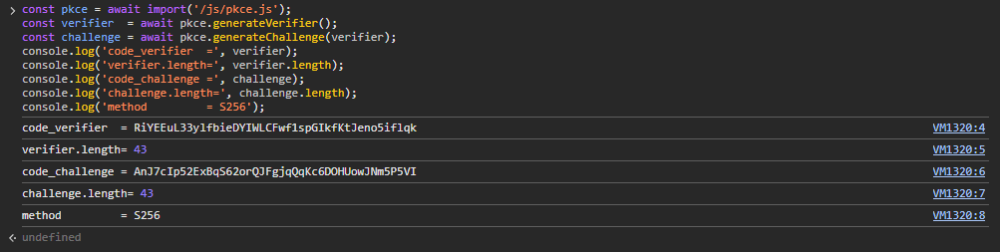

> **Вопрос:** Почему code_challenge передаётся в /authorize, а code_verifier — в /token? Что если перепутать?
>
> **Ответ:** *[Поясни логику: сначала сервер запоминает хэш (challenge), а при обмене кодом проверяет исходную строку (verifier). Если перепутать, сервер не сможет сопоставить значения и авторизация сорвётся]*

---

### Задание 11. Login flow
Реализован процесс перенаправления пользователя на сервер авторизации и возврат обратно на приложение (Callback).

#### 14-login-redirect.png
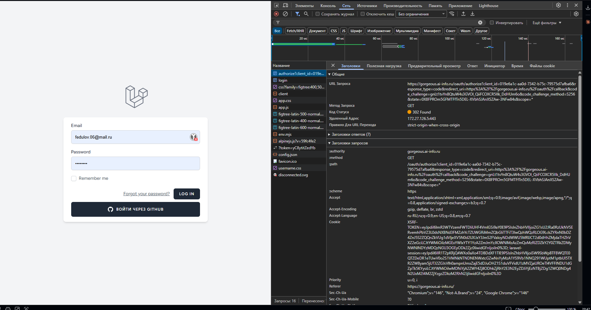

#### 15-login-callback.png
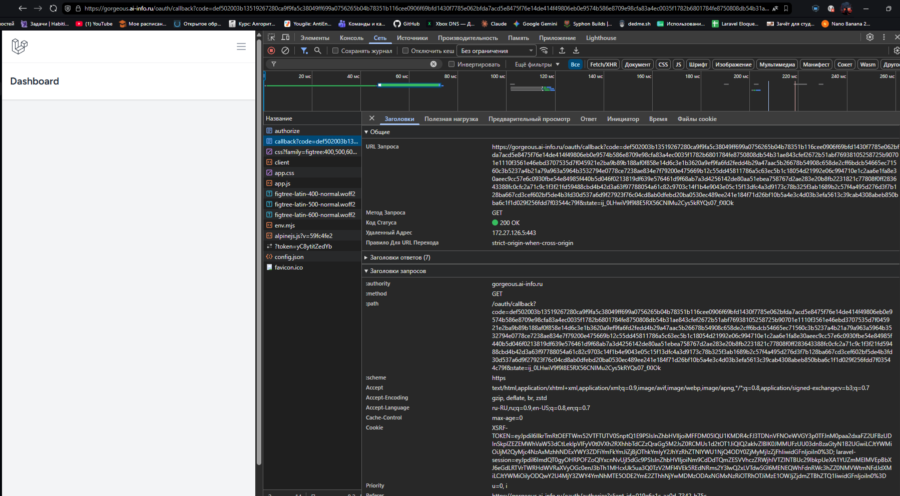

---

### Задание 12. Обмен code на токены
Реализован метод `handleCallback`, который сверяет параметр `state` и запрашивает access-токен в обмен на полученный `code`.

#### 16-token-exchange.png
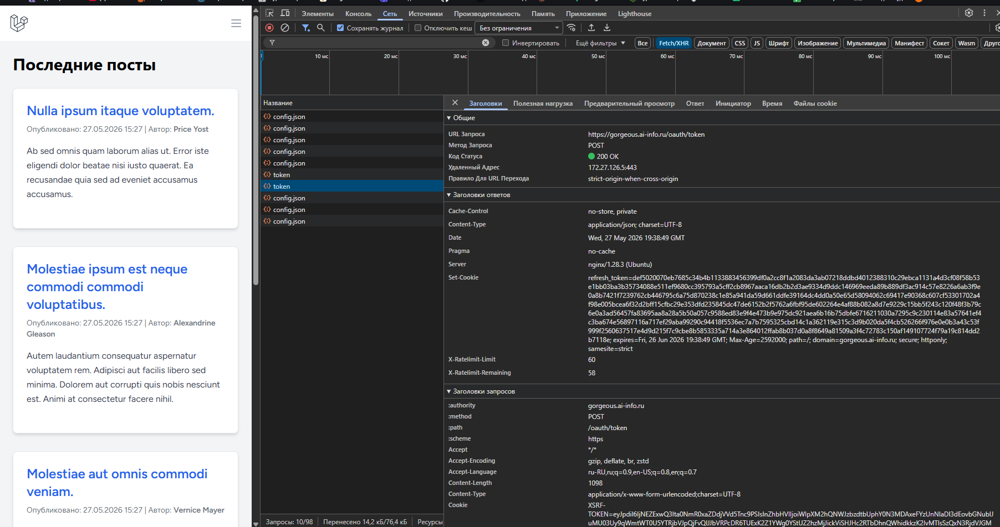

> **Вопрос:** Что произойдёт если убрать проверку state? Какая атака возможна?
>
> **Ответ:** *[Напиши про защиту от атак CSRF (Cross-Site Request Forgery) на этапе авторизации]*

---

### Задание 13. Refresh token в HttpOnly cookie
Для защиты токена обновления от кражи настроена мидлварь `RefreshTokenCookie`, которая переносит `refresh_token` в безопасную куку с флагами `HttpOnly` и `Secure`.

#### 17-refresh-cookie.png
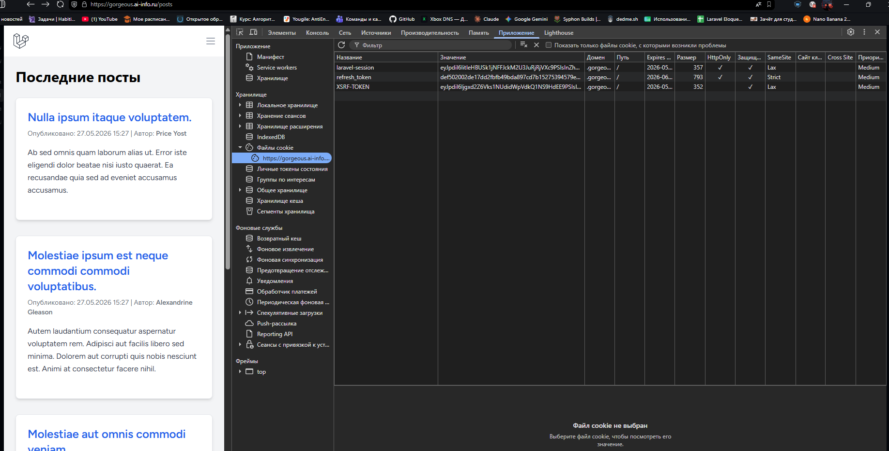

> **Вопрос:** Что случится если refresh положить в localStorage и сайт получит XSS?
>
> **Ответ:** *[Напиши, что злоумышленник через вредоносный скрипт сможет прочитать localStorage и украсть refresh-токен, получив долгосрочный доступ к аккаунту, в то время как HttpOnly куки недоступны для JS]*

---

### Задание 14. Silent refresh
Реализована автоматическая подмена токена (Silent Refresh). При получении `401 Unauthorized` от FastAPI, React прозрачно обновляет сессию и повторяет исходный запрос.

#### 18-silent-refresh.png
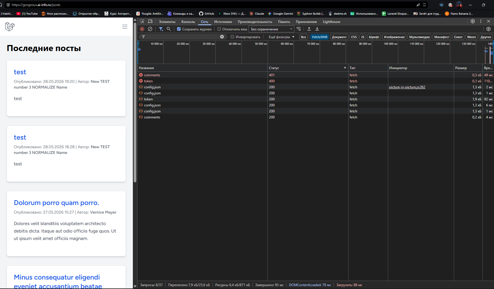

---

## Часть Д. Redis Pub/Sub

### Задание 15. Redis установлен
Установлен и настроен сервер Redis, порт `6379` закрыт от внешнего мира с помощью UFW.

#### 19-redis-ping.png
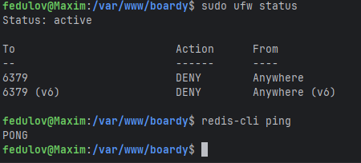

---

### Задание 16. Laravel publish new_post
Прямые синхронные HTTP-вызовы из Laravel к FastAPI удалены. Вместо этого при создании поста событие публикуется в Redis-канал.

#### 20-laravel-publish.png
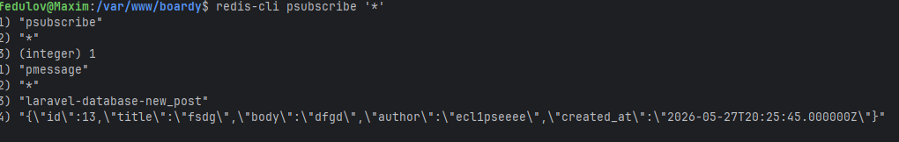

> **Вопрос:** Чем Redis::publish архитектурно лучше Http::post() к FastAPI?
>
> **Ответ:** *[Опиши преимущества слабой связанности (Loose Coupling), асинхронности, отсутствия задержек на основном бэкенде, если FastAPI временно "приляжет"]*

---

### Задание 17. FastAPI subscriber на new_post
В FastAPI настроен фоновый обработчик (через Lifespan), который слушает канал Redis и транслирует сообщения подключённым по WebSocket клиентам.

#### 21-subscriber-running.png
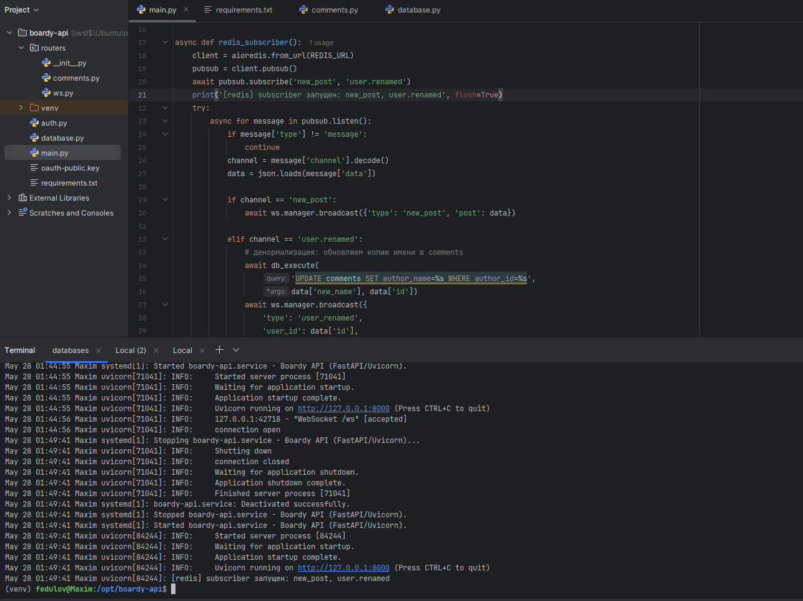

#### 22-broadcast-flow.png
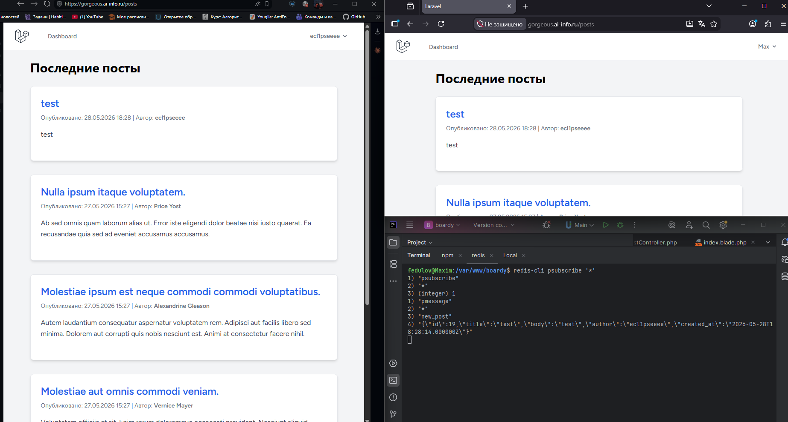

---

### Задание 18. User observer и user.renamed
Зарегистрирован `UserObserver` в Laravel для автоматического отслеживания изменения профиля пользователя и отправки события смены имени в брокер сообщений.

#### 23-user-renamed.png
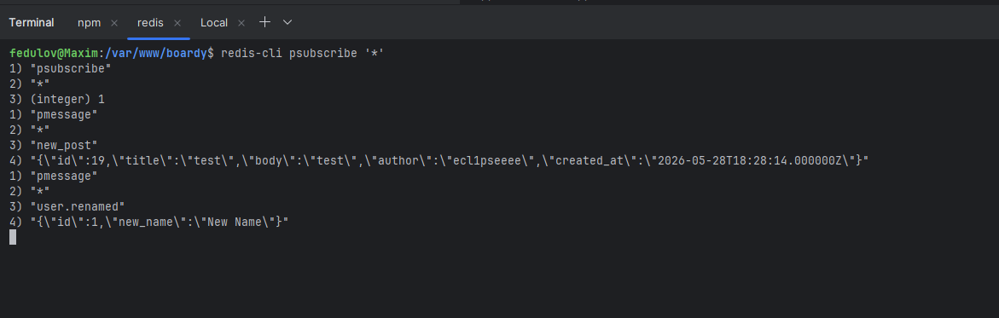

> **Вопрос:** Почему UserObserver вызывается автоматически? Где это магия Laravel?
>
> **Ответ:** *[Расскажи про события Eloquent моделей (updated, saved) и то, как Laravel связывает методы обсервера с жизненным циклом модели через регистрацию в Boot-методе провайдера]*

---

### Задание 19. Денормализация имени
FastAPI асинхронно обрабатывает событие `user.renamed` и актуализирует денормализованное поле `author_name` во всех комментариях этого пользователя.

#### 24-denorm-before.png
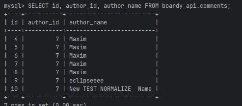

#### 25-denorm-after.png
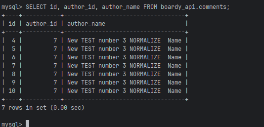

> **Вопрос:** Что такое eventual consistency? Когда между сменой имени и обновлением comments может быть задержка?
>
> **Ответ:** *[Дай определение согласованности в конечном счёте. Укажи, что задержка может возникнуть из-за высокой очереди в Redis, сетевых лагов или временной недоступности воркера FastAPI]*

---

## Часть Е. Финальные проверки

### Задание 20. Два браузера: посты в реалтайме
Проверена сквозная реактивность: создание публикации отображается у других пользователей без перезагрузки страницы (F5).

#### 26-two-browsers-post.png
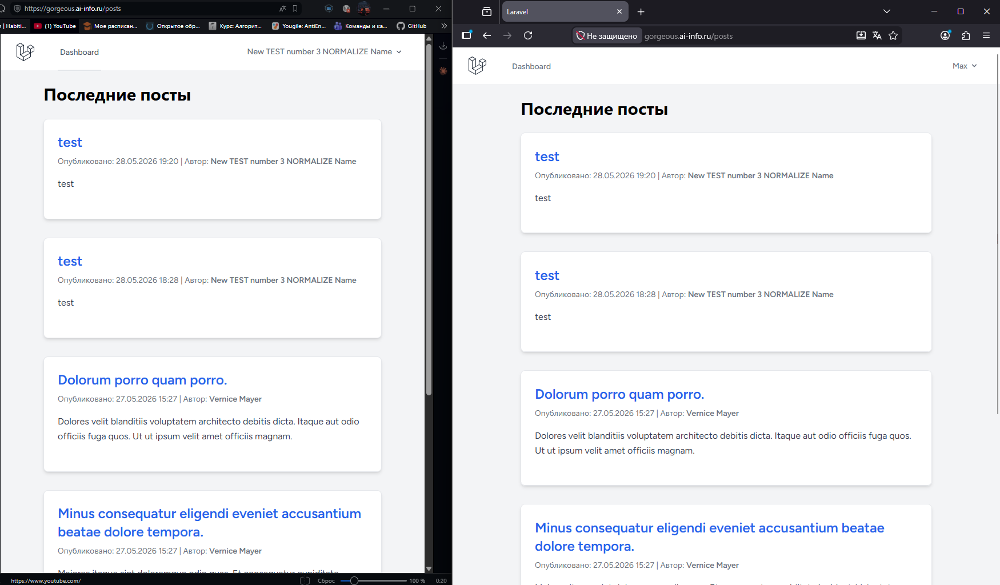

---

### Задание 21. Два браузера: комментарии в реалтайме
Все CRUD операции с комментариями синхронизируются по WebSockets мгновенно.

#### 27-two-browsers-comment.png
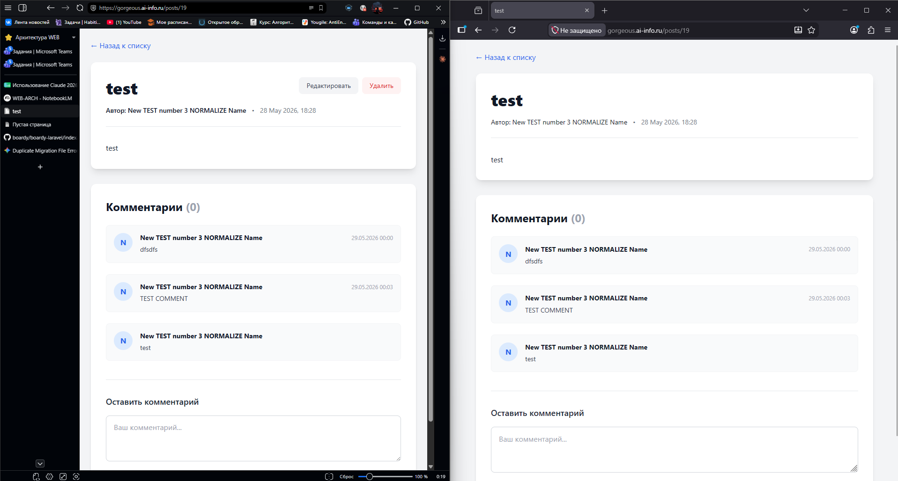

---

### Задание 22. Никаких прямых HTTP-вызовов
Архитектура полностью соответствует принципам Event-Driven. Между бэкендами Laravel и FastAPI нет прямого связывания через HTTP.

#### 28-no-http-callback.png
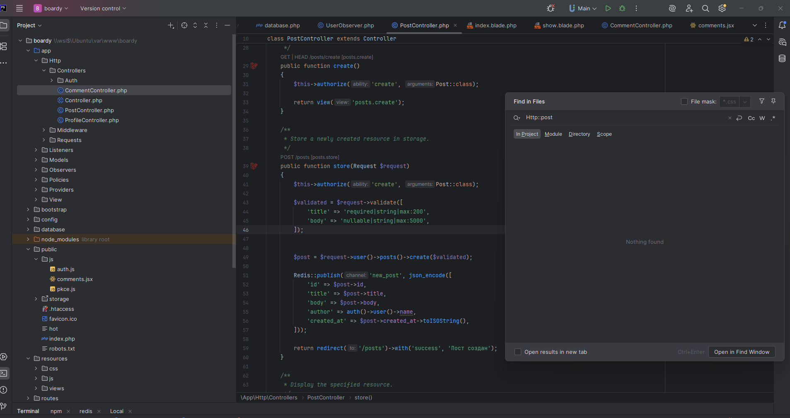

#### 29-nginx-no-internal.png
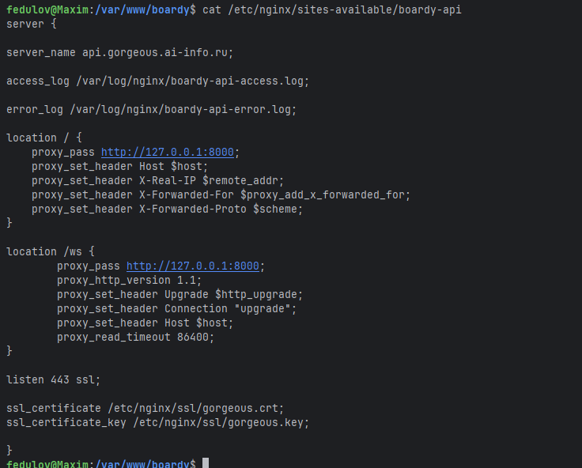