# Отчёт по практике 15 — Docker и Docker Compose

---

## Часть A. Dockerfile для Laravel

### 1. PHP-FPM с расширениями
#### 01-laravel-build.png
Здесь я использовал no-cache, так как у меня до этого были попытки запуска, но были неудачные. 
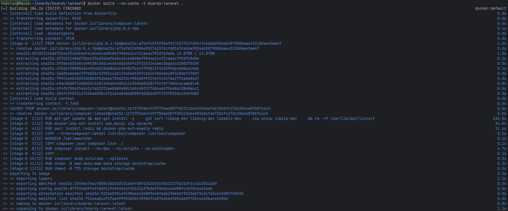

**Зачем PHP-FPM, а не Apache+PHP?**
PHP-FPM работает как отдельный процесс-менеджер, который обрабатывает PHP-запросы через FastCGI-протокол. Nginx — отдаёт статику и проксирует запросы — а PHP-FPM изолированно выполняет PHP-код. 
Apache+mod_php монолитен — PHP встроен прямо в веб-сервер => хуже для контейнеризации.

---

### 2. Кеширование composer-зависимостей
#### 02-composer-layer.png
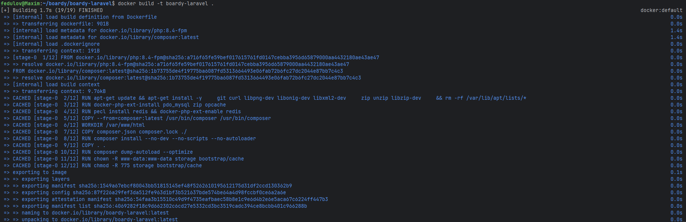

**Что произойдёт, если COPY всего проекта сделать ДО composer install?**
Docker строит образ послойно. Если сначала скопировать весь проект, то при изменении любого файла этот слой инвалидируется, и все последующие слои, включая `composer install`, пересобираются заново => при каждом изменении кода все зависимости будут скачиваться и устанавливаться с нуля.

---

### 3. .dockerignore
#### 03-dockerignore.png
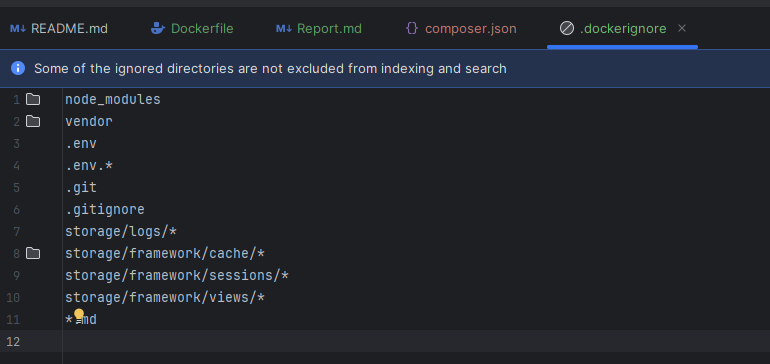

**Что произойдёт, если не исключить `.env` из образа?**
Файл `.env` содержит секреты: пароли БД, API-ключи, токены, `APP_KEY`. Если не добавить его в `.dockerignore`, он попадёт в образ и окажется в каждом слое файловой системы контейнера.  Это прямая утечка credentials.

---

## Часть Б. Dockerfile для FastAPI

### 4. requirements.txt
#### 04-requirements.png
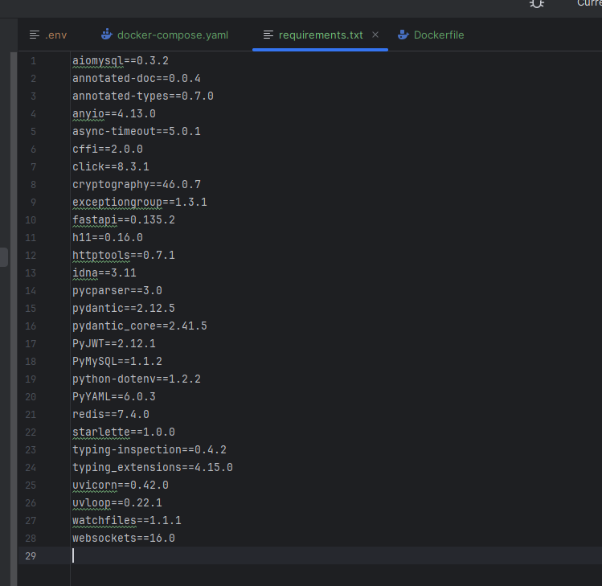

**Почему версии фиксируем, а не пишем `latest`?**
Без фиксации версий при каждой сборке образа pip устанавливает актуальные на тот момент версии. 
Через год некоторые библиотеки могут выпустить мажорные обновления, и приложение просто перестанет собираться или работать. 
Фиксация версий гарантирует, что образ, собранный сегодня и через год, ведёт себя одинаково.

---

### 5. Сборка образа FastAPI
#### 05-fastapi-build.png
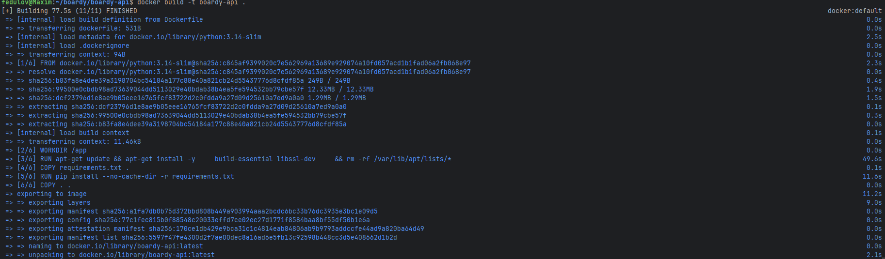

---

### 6. CMD с правильным host
#### 06-uvicorn-cmd.png
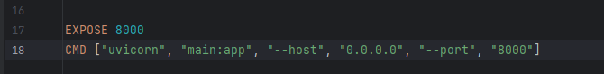

**Почему `--host 0.0.0.0`, а не `127.0.0.1`?**
Внутри контейнера `127.0.0.1` — это loopback-интерфейс самого контейнера. Nginx работает в другом контейнере и обращается к FastAPI через Docker-сеть. Если uvicorn слушает только `127.0.0.1`, то запросы от Nginx будут отклонены — они приходят на сетевой интерфейс контейнера. 
`0.0.0.0` означает «слушать на всех интерфейсах».

---

## Часть В. Конфиг Nginx

### 7. docker/nginx/default.conf
#### 07-nginx-conf.png
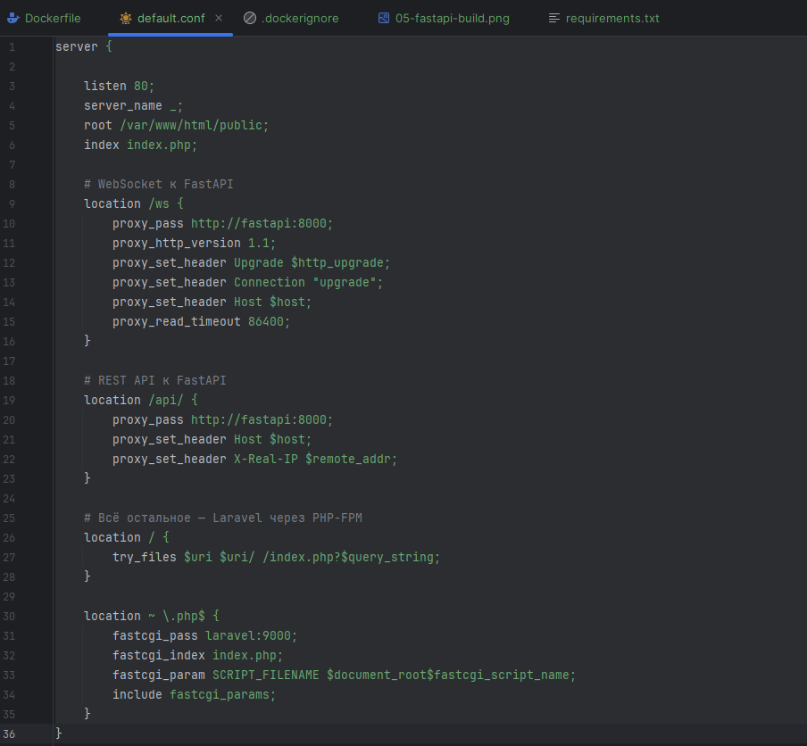

**Почему `laravel:9000`, а не `127.0.0.1:9000`?**
В Docker Compose все сервисы внутри одной сети резолвятся по имени сервиса. Docker запускает встроенный DNS-сервер, который знает о контейнерах в сети. Когда Nginx обращается к `laravel:9000`, Docker DNS возвращает IP-адрес контейнера `laravel`. `127.0.0.1` указывает на сам контейнер Nginx — там PHP-FPM не запущен.

---

### 8. WebSocket location
#### 08-ws-config.png
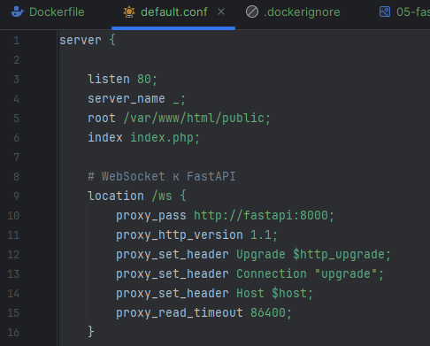

---

## Часть Г. docker-compose.yml

### 9. Пять сервисов
#### 09-compose-services.png
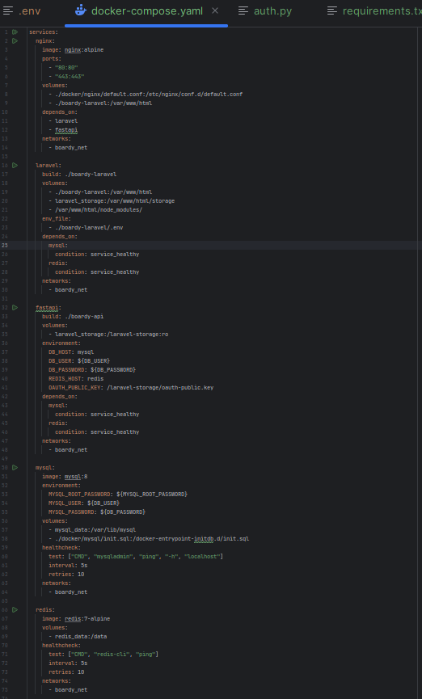

Здесь добавил volume в laravel с node_modules, чтоб работал frontend в laravel

---

### 10. Volumes
#### 10-volumes.png
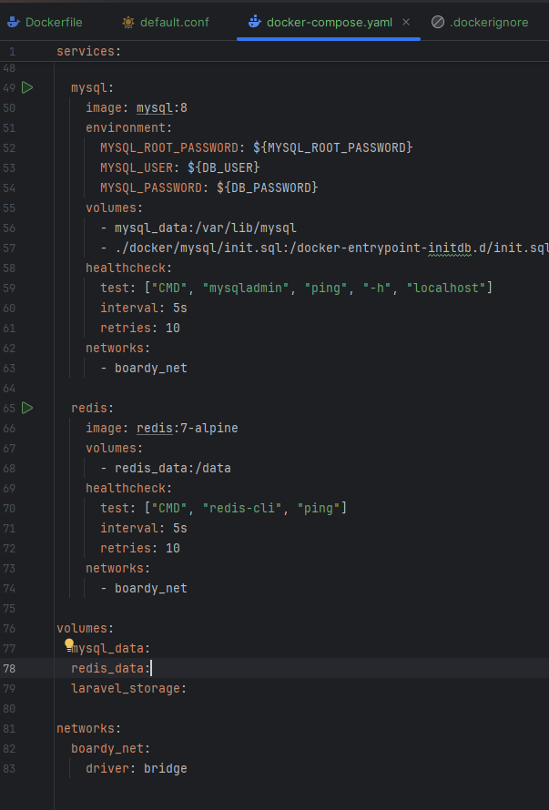

**Что произойдёт с данными MySQL без `mysql_data` volume после `docker compose down`?**
Без именованного volume данные хранятся внутри слоя контейнера. При `docker compose down` контейнер удаляется вместе со всеми данными — база уничтожается безвозвратно.

**Чем именованный volume отличается от bind-mount?**
Именованный volume управляется Docker: данные хранятся в `/var/lib/docker/volumes/` на хосте, не привязаны к конкретному пути, переносимы. Bind-mount монтирует конкретную директорию хоста — это удобно для разработки, но менее изолировано.

---

### 11. Healthcheck для MySQL и Redis
#### 11-healthcheck.png
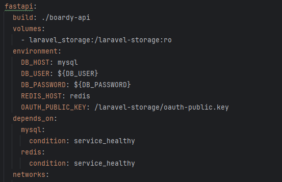
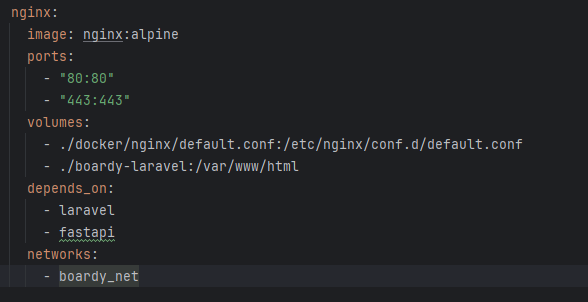
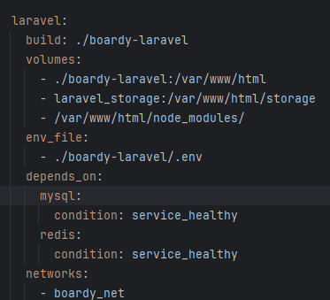


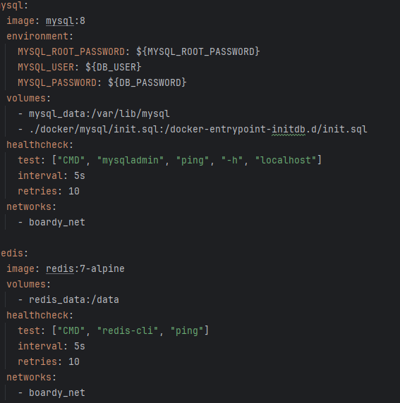

**Почему `depends_on` без `healthcheck` недостаточно?**
`depends_on` без условий гарантирует только порядок запуска контейнеров, но не их готовность. MySQL после старта контейнера несколько секунд инициализируется. Если Laravel запустится сразу после старта контейнера MySQL — он получит отказ в подключении. Это race condition: Laravel стартует слишком рано. 
`condition: service_healthy` с healthcheck заставляет Docker ждать, пока MySQL не ответит на `mysqladmin ping`.

---

### 12. init.sql для двух БД
#### 12-init-sql.png
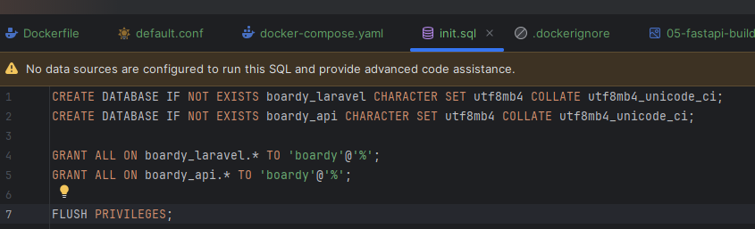

#### 13-databases-created.png
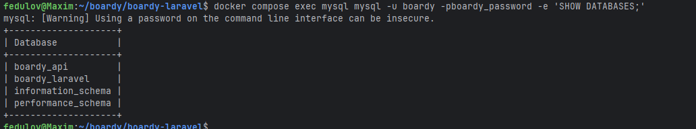

**Почему `init.sql` выполняется только при первом запуске?**
MySQL-контейнер выполняет скрипты из `/docker-entrypoint-initdb.d/` только при инициализации пустого volume. Если `mysql_data` уже содержит данные, скрипт игнорируется. Поэтому если изменить `init.sql` после первого запуска — ничего не произойдёт.

---

### 13. Два .env файла
#### 14-env-compose.png
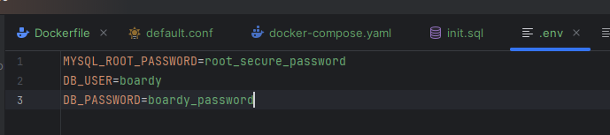

#### 15-env-laravel.png
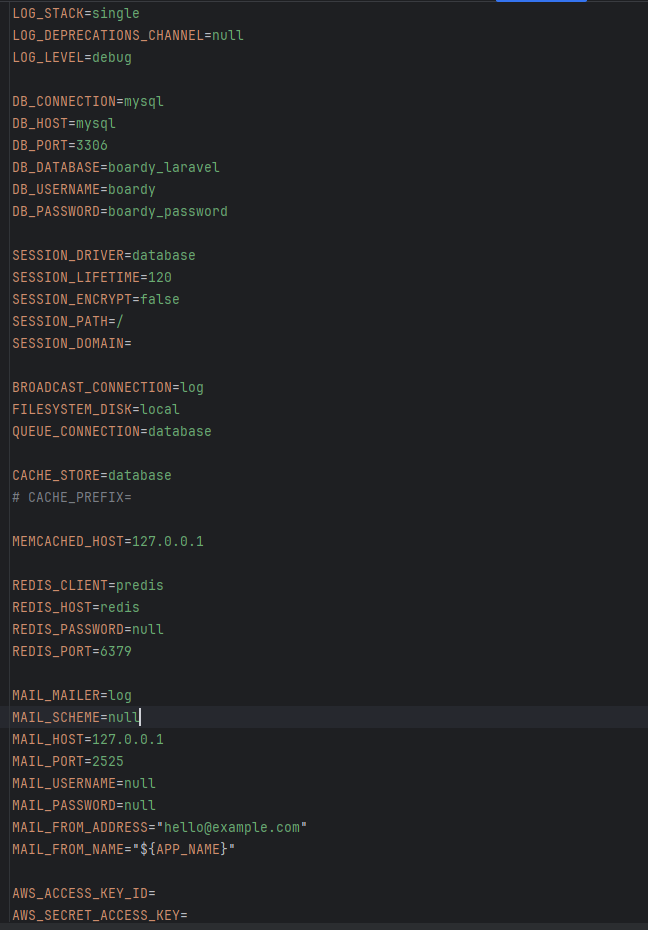

Здесь также был изменен APP_URL и другие .env конфиги для адаптации под docker. В том числе SESSION_DOMAIN

**Зачем два разных `.env`?**
Корневой `.env` используется Docker Compose для подстановки переменных в `docker-compose.yml` (пароли БД, имена пользователей). Laravel `.env` — это конфигурация самого приложения. Разделение позволяет изменять параметры независимо от параметров приложения.

**Почему `DB_HOST=mysql`, а не `127.0.0.1`?**
Внутри контейнера `127.0.0.1` — это loopback самого Laravel-контейнера, MySQL там не запущен. `mysql` — это имя сервиса в `docker-compose.yml`, которое Docker DNS резолвит в IP контейнера MySQL внутри `boardy_net`.

---

## Часть Д. Запуск и проверка

### 14. docker compose up
#### 16-compose-up.png
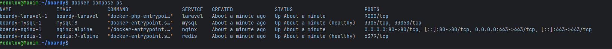

---

### 15. Миграции в контейнере
#### 17-migrate.png
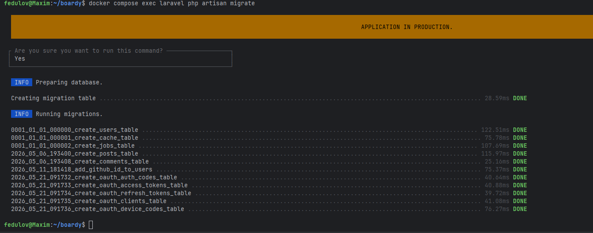

#### 18-passport-install.png
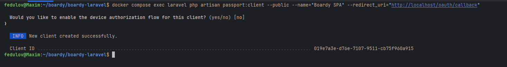

**Чем `docker compose exec` отличается от `docker compose run`?**
`exec` выполняет команду внутри уже запущенного контейнера. `run` создаёт новый контейнер на основе образа сервиса — используется для одноразовых задач или когда основной контейнер не запущен.

---

### 16. Приложение работает
#### 19-app-running.png
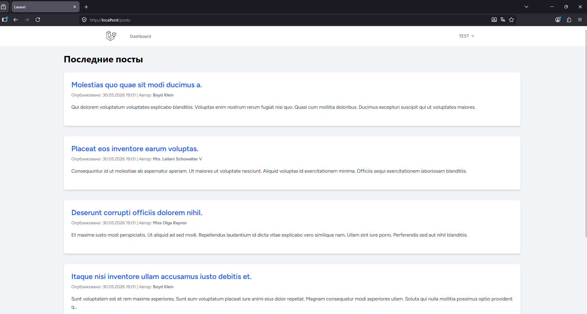

#### 20-comment-works.png
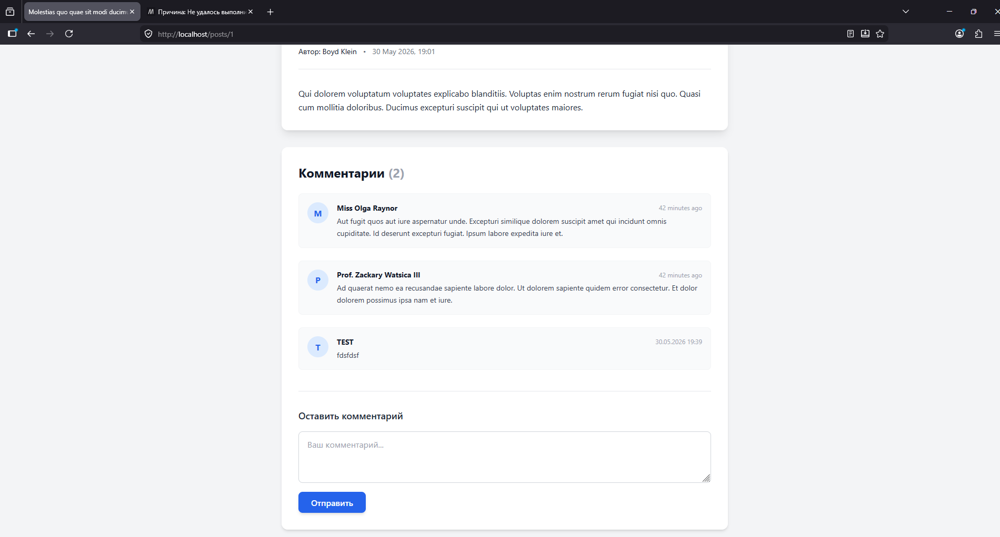

---

### 17. Реалтайм работает
#### 21-realtime-posts.png
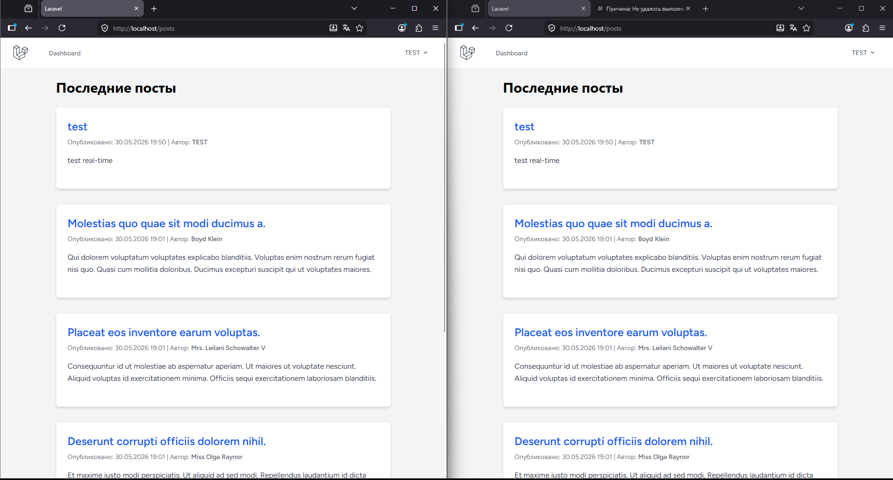

#### 22-realtime-comments.png
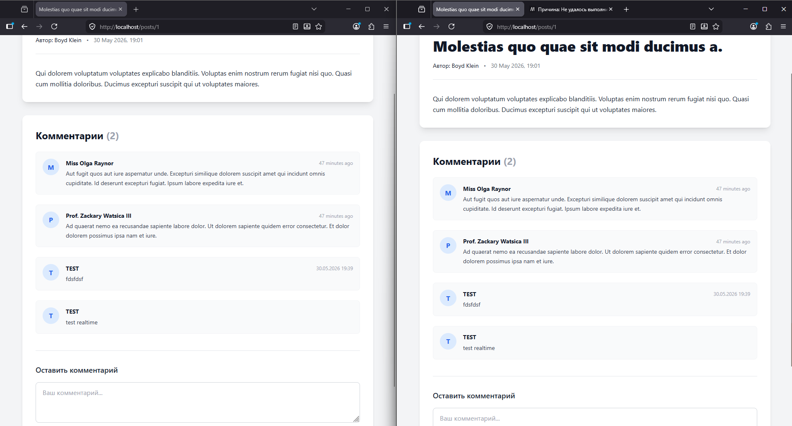

---

### 18. Данные переживают перезапуск
#### 23-persist.png
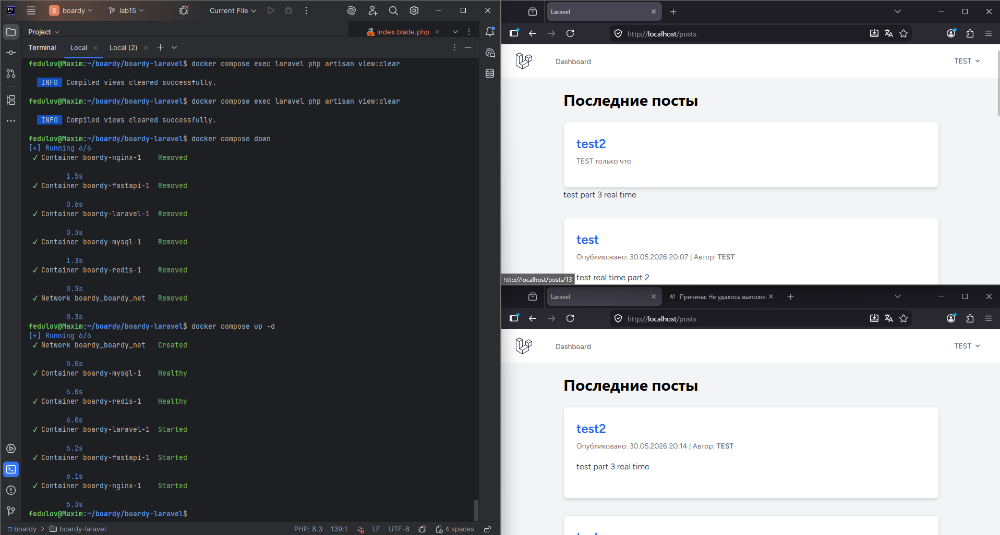

**Что произойдёт при `docker compose down -v`?**
Флаг `-v` удаляет все именованные volumes вместе с контейнерами. Это означает полное уничтожение данных MySQL и Redis — все пользователи, посты и комментарии исчезнут. Без флага `-v` volumes сохраняются на хосте и данные остаются после повторного `docker compose up`. Флаг `-v` опасен в продакшене.

---

### 19. Централизованные логи
#### 24-logs.png
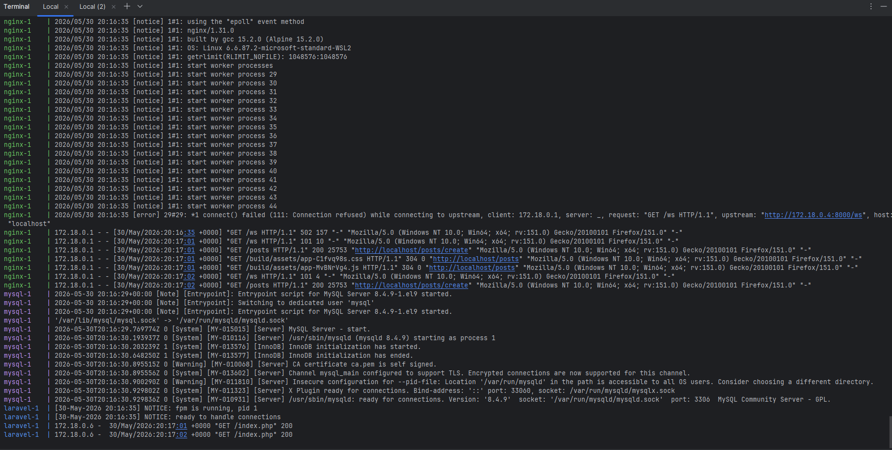

**Плюсы централизованных логов Docker vs `tail -f /var/log/*` на хосте:**
- Все сервисы — один поток, не нужно открывать несколько терминалов
- Временны́е метки и имена сервисов добавляются автоматически
- Логи не зависят от того, куда приложение пишет файлы — Docker собирает stdout/stderr контейнера

---

### 20. Чистая машина
#### 25-fresh-install.png
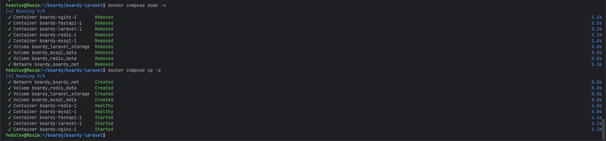

Однако также нужно будет еще накатить миграции, создать passport и запустить npm run dev(build) для полноценной работы.
**Команды от клона до рабочего приложения:**
```bash
git clone https://github.com/ecl1pseeee-boop/boardy
cd boardy
cp .env.example .env
# заполнить .env и boardy-laravel/.env
docker compose up --build -d
docker compose exec laravel php artisan migrate
docker compose exec laravel php artisan passport:install
```