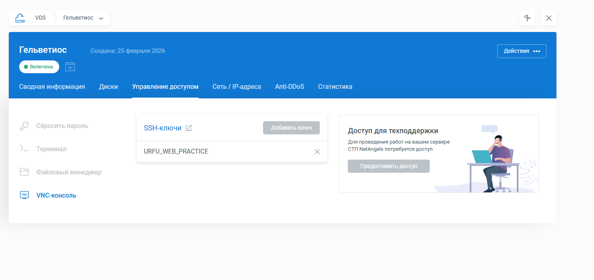
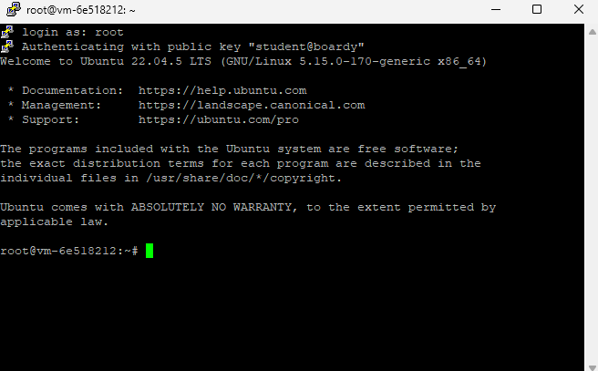

# Отчет по лабораторной работе

### В данной работе я буду использовать хостинг NetAngels, так как я должен денег VK Cloud и не могу взять у них VPS. NetAngles VPS сервер требует алгоритм ассиметричной криптографии RSA, а не ed25519. Поэтому в дальнейшем будет сгенерирован ключик с RSA.

### 1. SSH-ключ
#### 01-vm-settings.png

### 2. VPS в NetAngels
#### 02-vps.png and 03-firewall.png

### Настройки firewall на NetAngels уже заранее прописаны и готовы к использованию

### 3. Подключение через PuTTY
#### 04-putty.png

### 4. Настройка сервера
#### 05-hostname.png

### 5. Пользователь student
#### 06-student.png

### 6. Git и SSH-ключ -> GitHub
#### 07-git-config__08-ssh-github.png

### 7. Репозиторий и структура
#### 09-github-repo.png

### 8. Ветка и Pull Request
#### 10-pull-request.png

