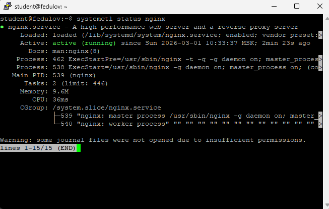
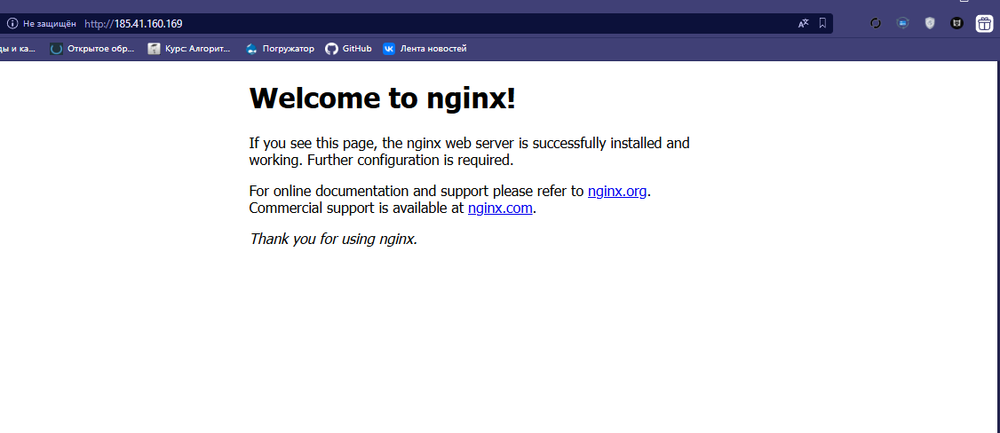
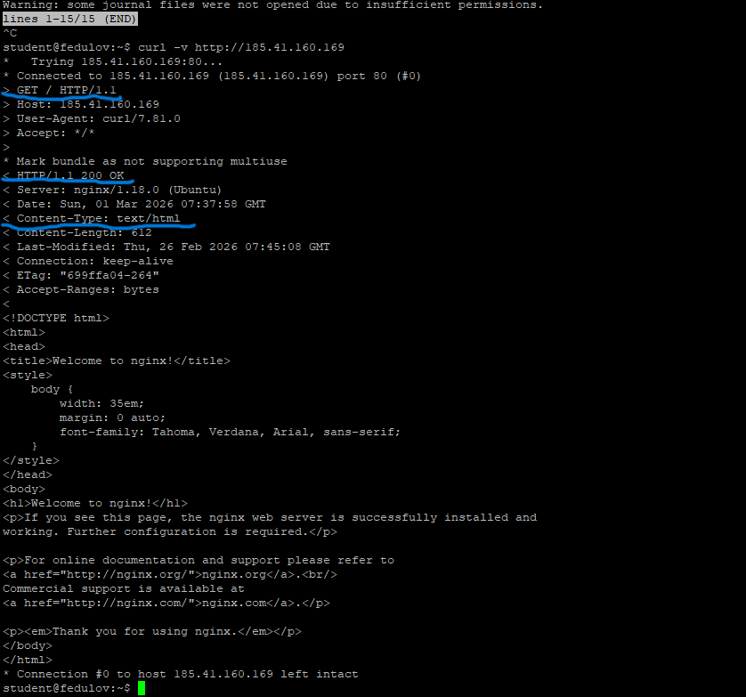
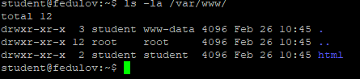
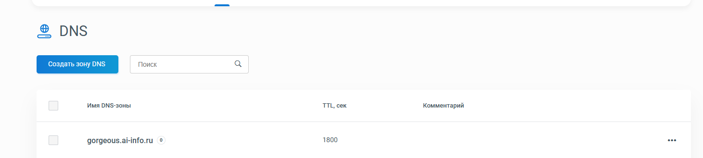
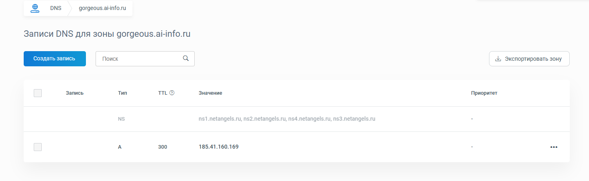
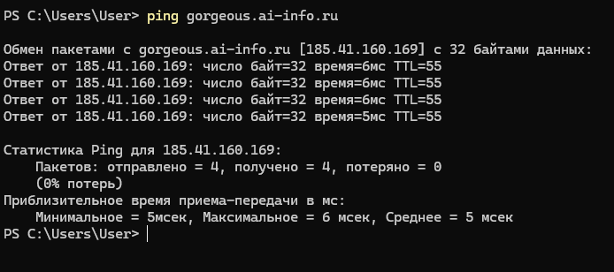
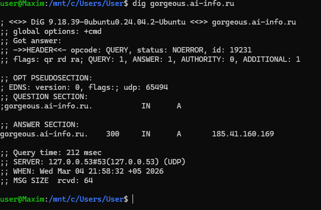
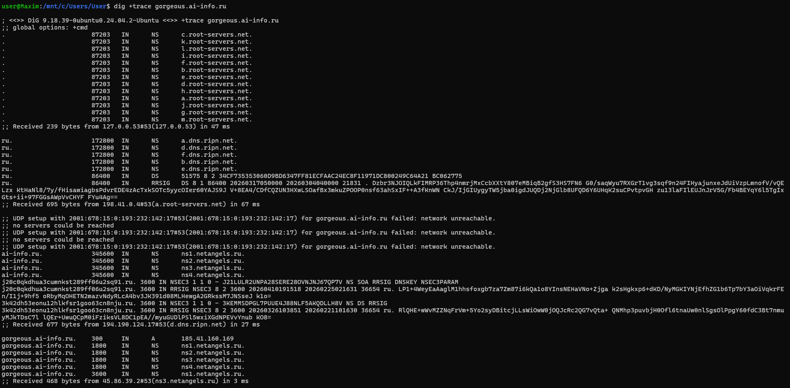
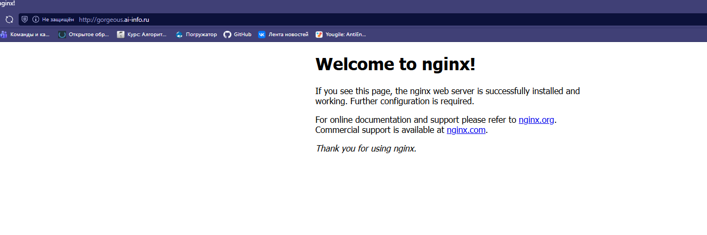

# Отчет по лабораторной работе

### 1. Установка Nginx


### 2. Страница по IP


### 3. Curl


### 4. Директория и права


### 5. Конфигурация Nginx
``` listen 80 default_server ``` - какой порт слушать
``` root /var/www/html ``` - откуда брать файлы
``` server_name _ ``` - имя хоста
``` index index.html index.htm index.nginx-debian.html ``` - где лежит index файл

### 6. DNS-зона


### 7. A-запись


### 8. ping


### 9. dig


### 10. dig + trace


### 11. Сайт по домену

