# Отчет по лабораторной работе

### 1. Директория проекта
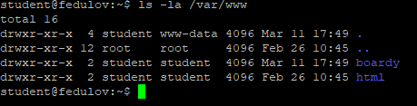

### 2. Конфиг виртуального хоста
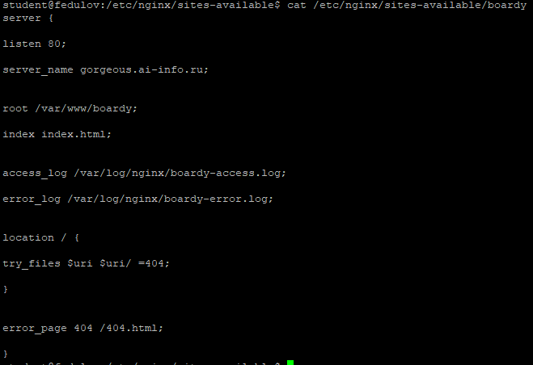

### server_name: Имя домена, по которому сервер будет идентифицировать и обрабатывать входящие запросы.

### root: Корневая директория, из которой сервер будет отдавать контент.

### access_log: Информация о каждом обработанном запросе.

### error_log: Сообщения об ошибках и предупреждениях.

### try_files: Проверяет существование перечисленных файлов или директорий и возвращает первый найденный вариант или заданный код ответа.

### error_page: Перенаправляет пользователя на указанную страницу при возникновении определённой ошибки HTTP.

### 3. Лендинг
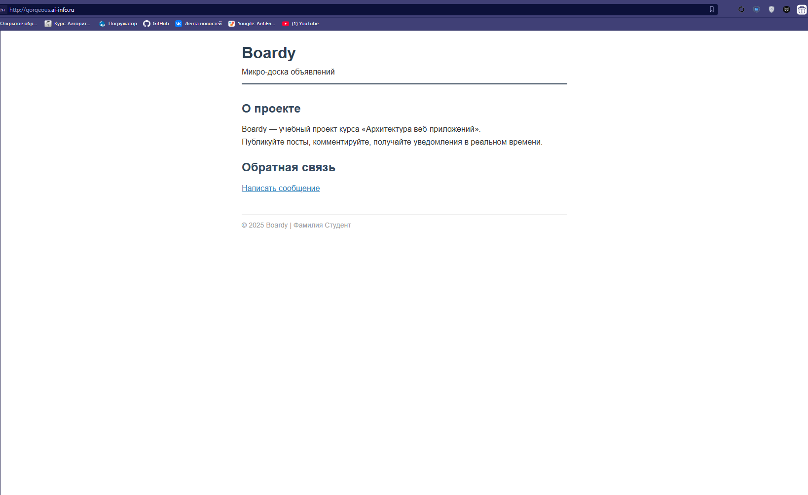

### 4. Форма в браузере
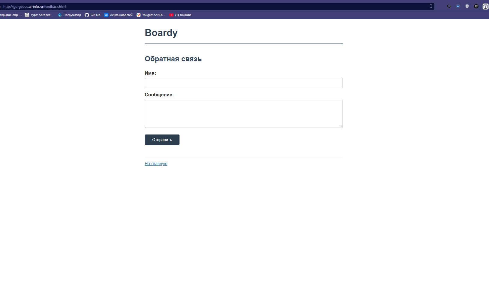

### 5. Стили и 404
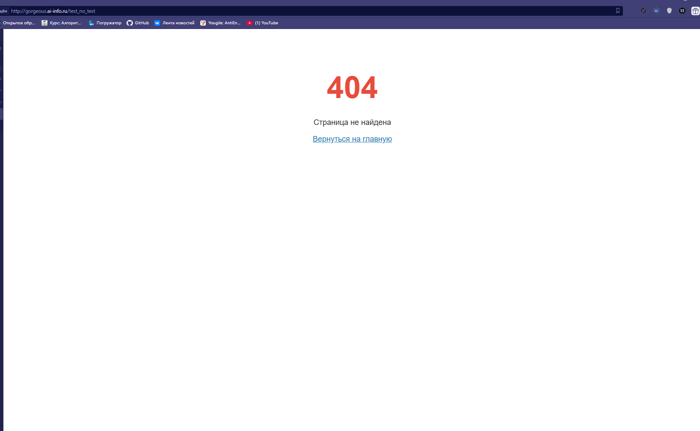

### 6. DNS-запись для поддомена
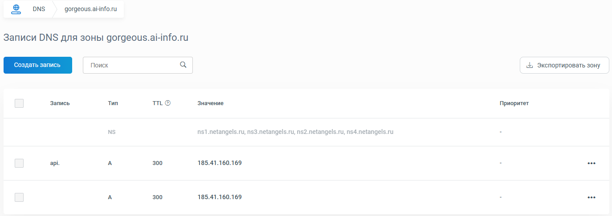

### 7. Проверка DNS
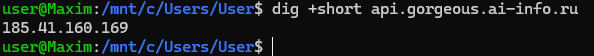

### 8. Конфиг и заглушка API
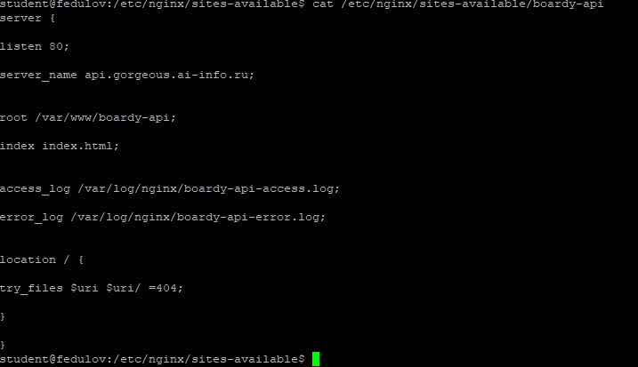
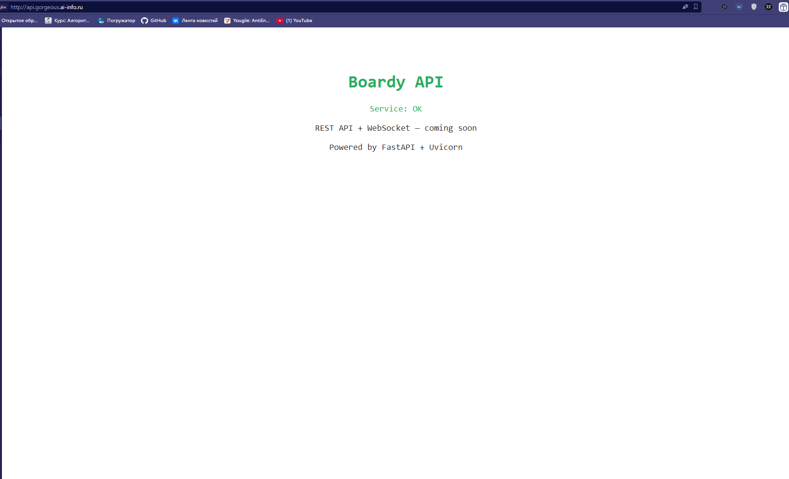

### 9. GET-запрос через curl -v
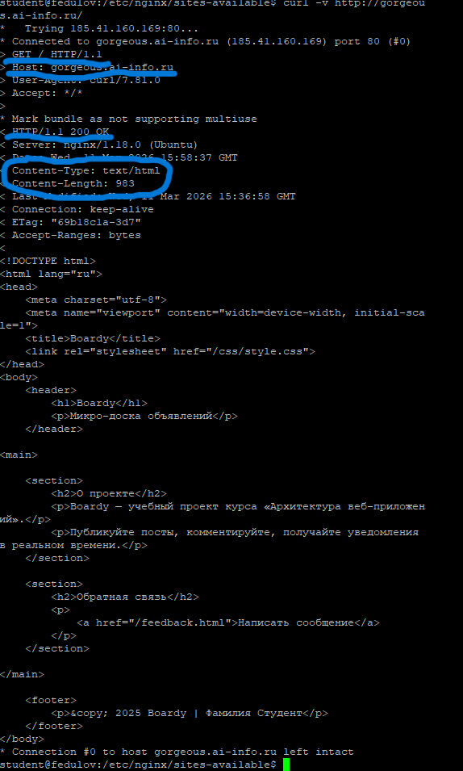

### 10. Виртуальные хосты в действии
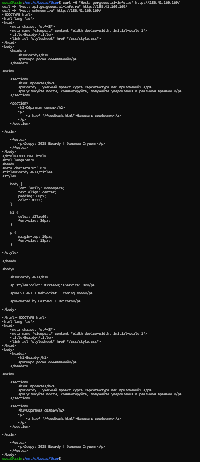
Веб-сервер (Nginx/Apache) использует заголовок Host для определения, какой именно сайт показать. На одном IP могут работать несколько сайтов, и сервер выбирает нужный по имени из заголовка Host.
Третий запрос с Host: unknown.ru либо вернёт ошибку 404, либо покажет сайт по умолчанию (первый в конфигурации). Это потому, что домен unknown.ru не настроен на сервере — для него нет виртуального хоста.

### 11. POST-запрос
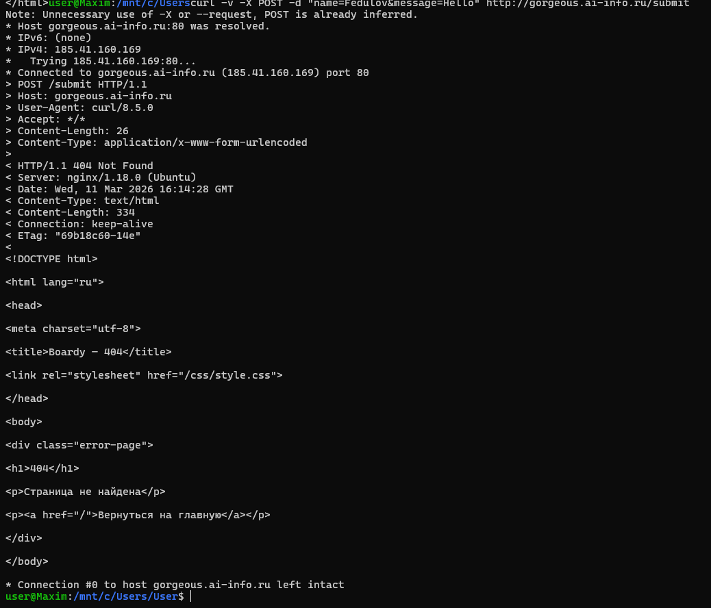
405 — не ошибка. Nginx не обрабатывает данные.

### 12. HEAD-запрос
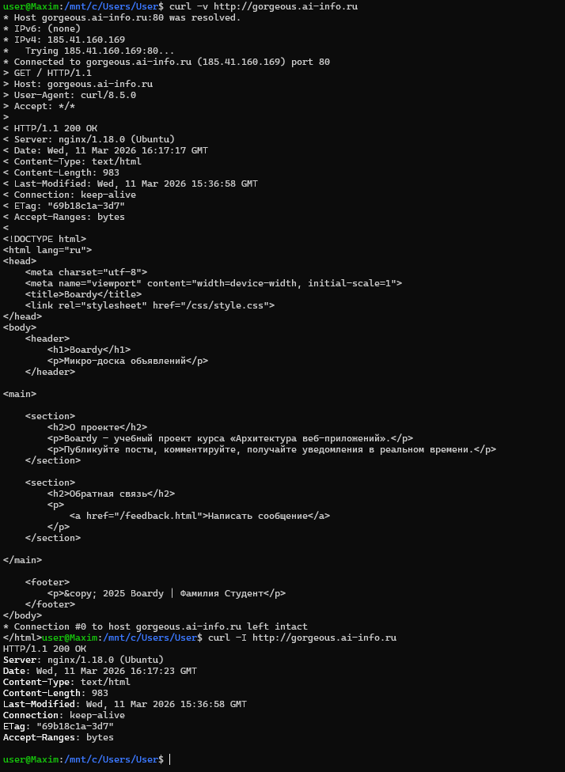
HEAD: Ответ без тела. Быстрая проверка: существует ли, какой размер, какой тип.
GET: Ответ с телом

### 13. Раздельные логи
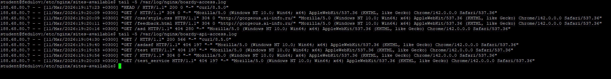

### 14. Фильтрация логов
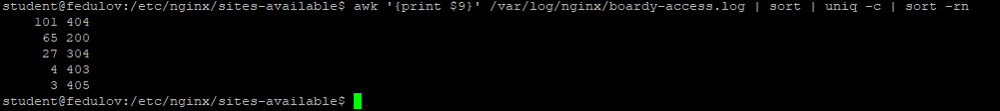