# Отчет по лабораторной работе:

### 1. Установка certbot
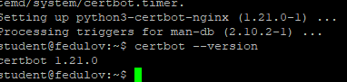

### 2. Получение сертификата
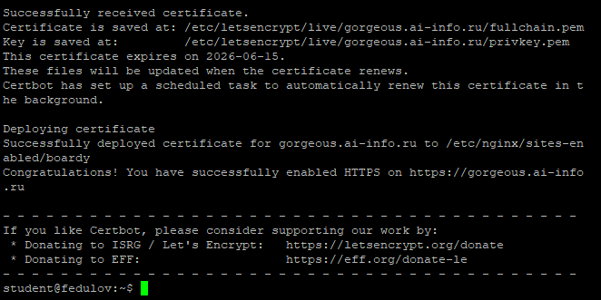

### 3. Проверка в браузере
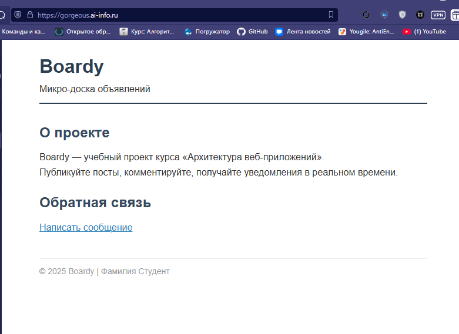
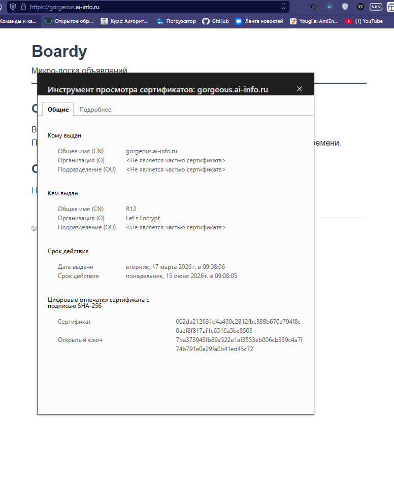

### 4. Редирект
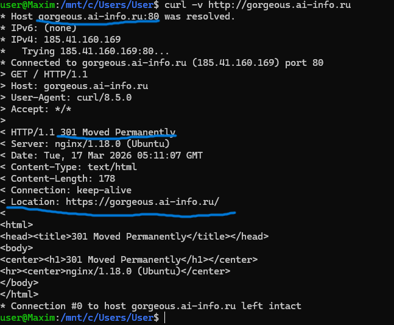

### 5. Конфиг после certbot
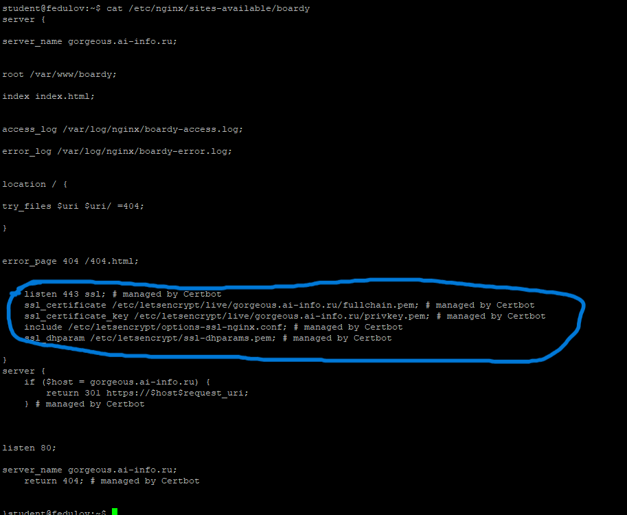

### 6. Сертификат для api-поддомена
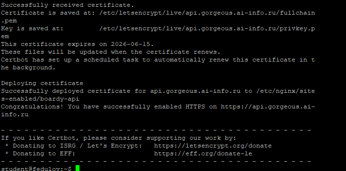

### 7. Проверка обоих доменов
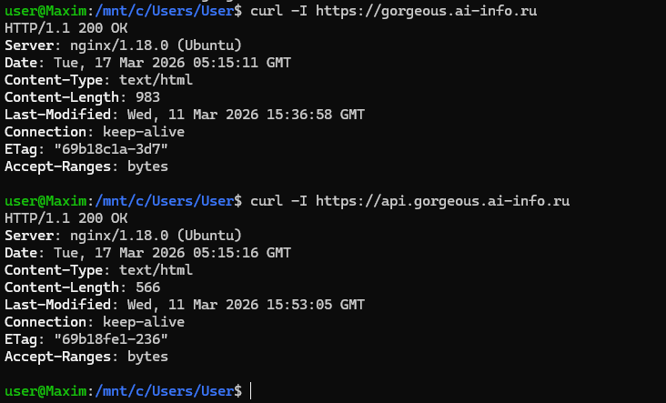

### 8. TLS handshake
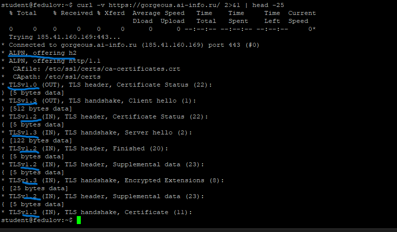

### 9. Цепочка доверия
Браузер проверяет снизу вверх. Сертификат - Let's Encrypt. Let's Encrypt подписан ISRG Root X1. ISRG Root встроен в ОС.
Если все сходится, то появляется замочек.
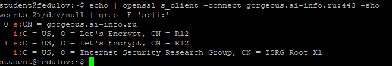

### 10. Сравнение сертификатов
Сертификаты отличаются subject.
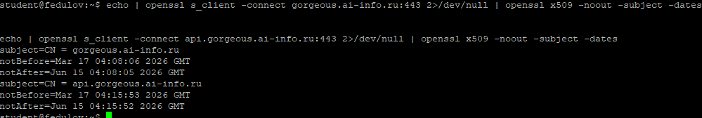

### 11. HSTS
Браузер запоминает, что сайт — только HTTPS. Если же пользователь решит зайти через "http://gorgeous.ai-info.ru", то браузер сам заменит на "https://gorgeous.ai-info.ru" еще до отправки запроса
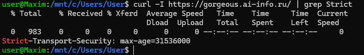

### 12. Кэширование и gzip
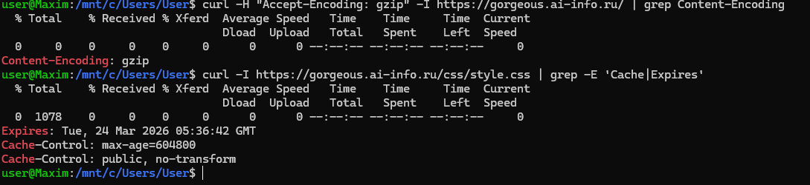

### 13. Автообновление
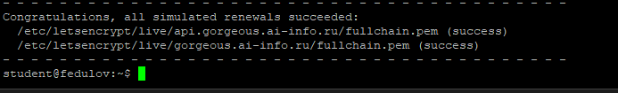