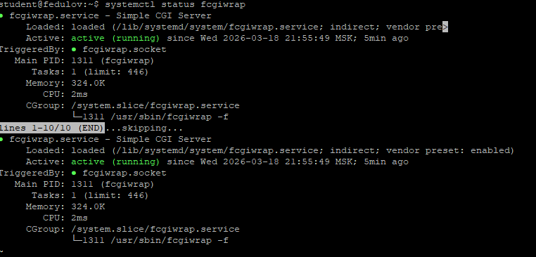
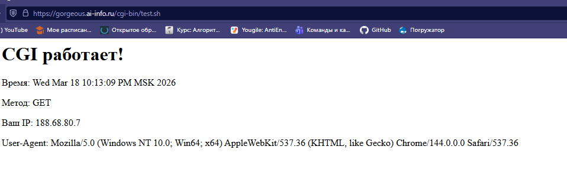
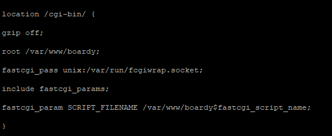
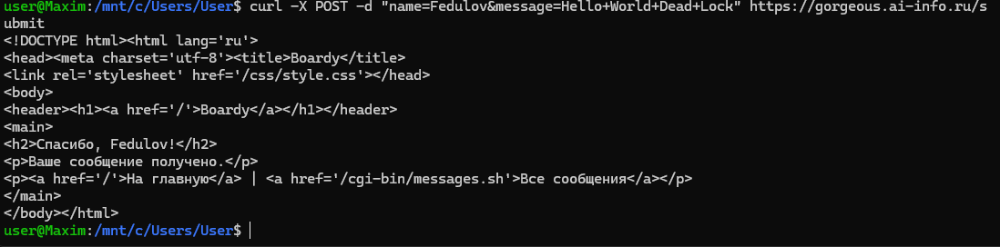
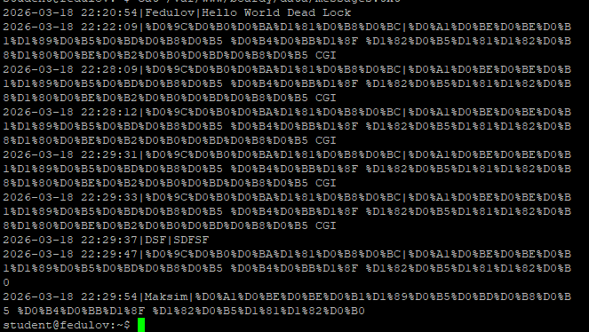
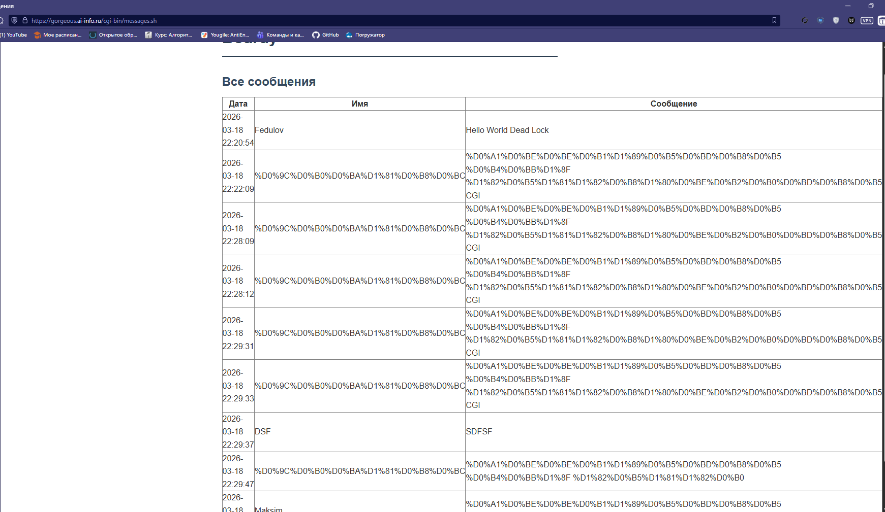
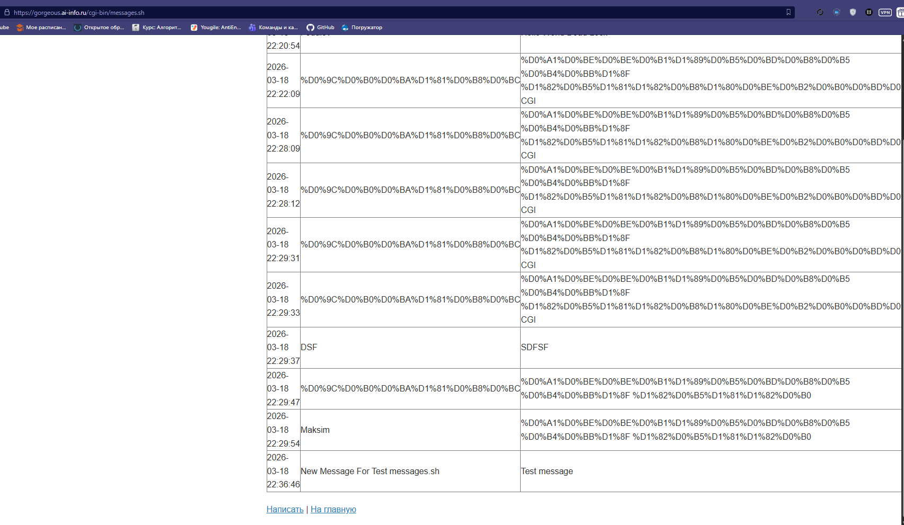
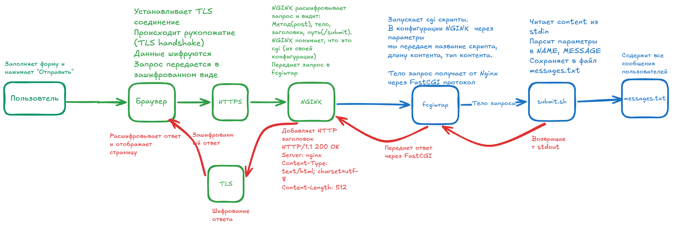
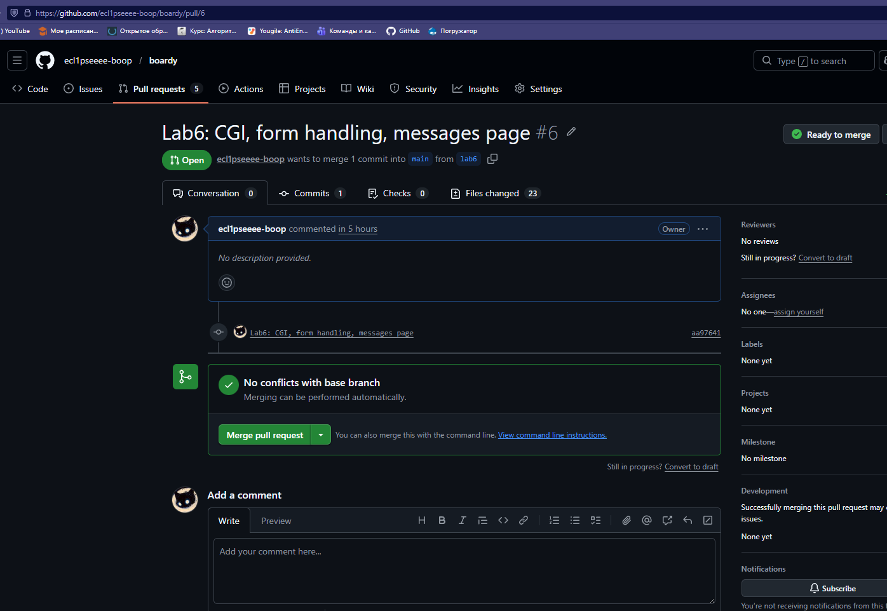

# Отчет по лабораторной работе

### 1. Установка fcgiwrap

### 2. Тестовый скрипт

### 3. Конфигурация Nginx

##### location /cgi-bin/  - данная конфигурация применяется для всех запросов, начинающихся с /cgi-bin/

##### gzip off - Отключает сжатие ответов для CGI скриптов

##### root /var/www/boardy - Устанавливает корневую директорию (все пути к файлам будут браться из этой директории)

##### fastcgi_pass unix:/var/run/fcgiwrap.socket - Указывает, куда передавать запросы на обработку (в UNIX сокет демона fcgiwrap)

##### include fastcgi_params - Подключает стандартный набор fastcgi параметров

##### fastcgi_param SCRIPT_FILENAME /var/www/boardy%fastcgi_script_name - Передает путь к файлу на диске, где "fastcgi_script_name" - имя файла 

### 4. Скрипт обработки формы

### 5. Форма в браузере

### 6. Данные на диске

#### Здесь есть набор непонятных символов. Дело в том, что скрипт понимает только английский язык.

### 7. Скрипт вывода сообщений

### 8. Полный цикл

### 9. Путь запроса

### 10. Теоретические вопросы
1. CGI(Command Gateway Interface) - протокол, который позволяет веб-серверу запускать внешние программы. Он дал возможность создавать формы, работать с базами данных и создавать персонализированные страницы.
2. CGI данные POST-запроса получает через stdin, а дальше отдает через stdout.
3. Для каждого запроса сервер создает отдельный процесс и запускает скрипт заново. 
4. Fastcgi передает запрос через FastCGI-протокол отдельному процессу(fcgiwrap или PHP-FPM). proxy_pass передает запрос как полноценный HTTP-запрос на другой сервер
5. fcgiwrap нужен больше для nginx, потому что он не умеет запускать CGI скрипты

### 11. PR
