# Отчет по лабораторной работе

### 1. Установка PHP-FPM
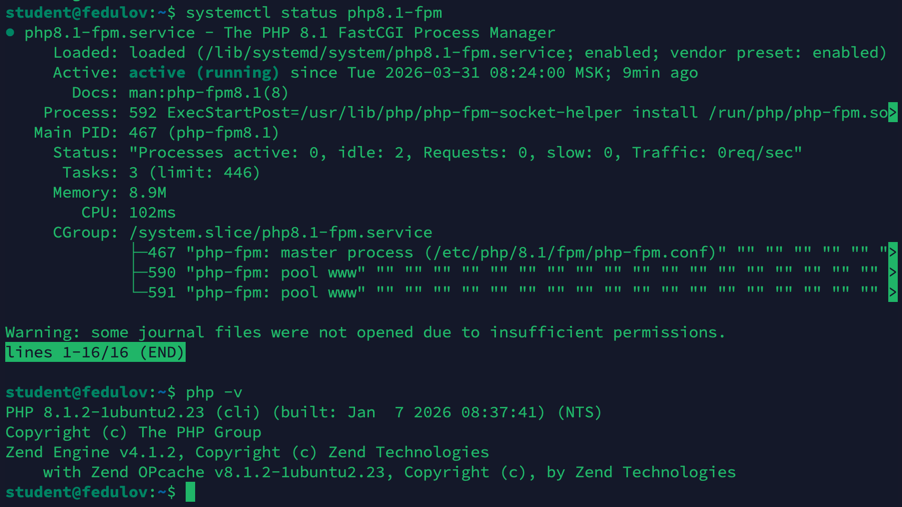

### 2. Форма и сообщения на PHP
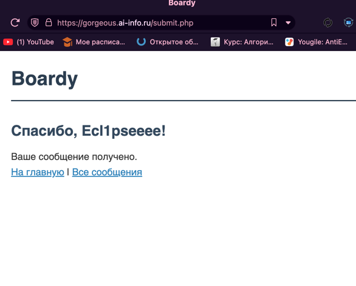
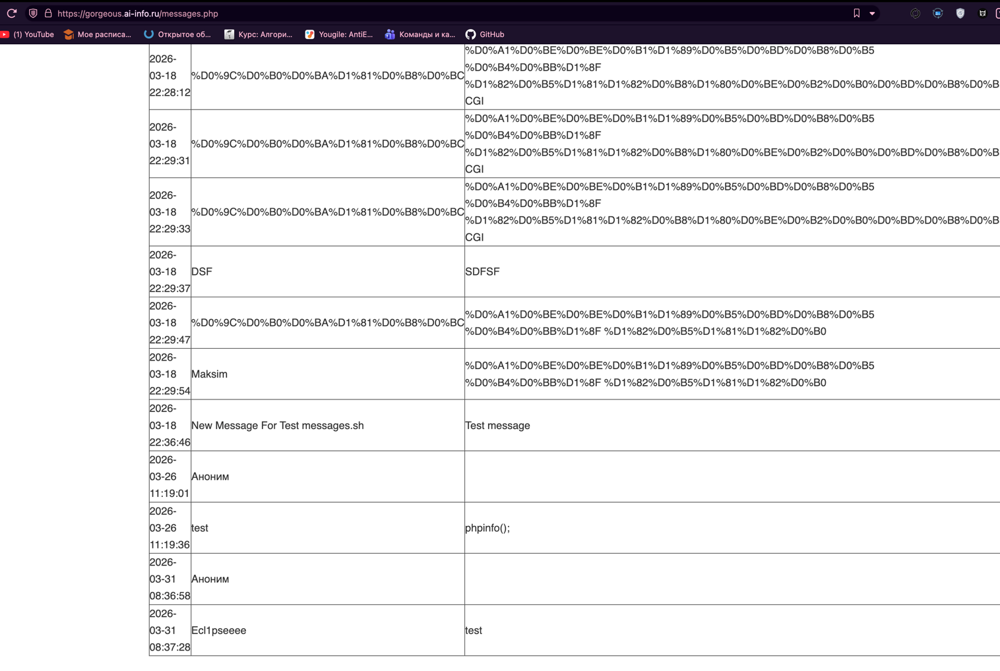

### 3. Конфиг Nginx для PHP
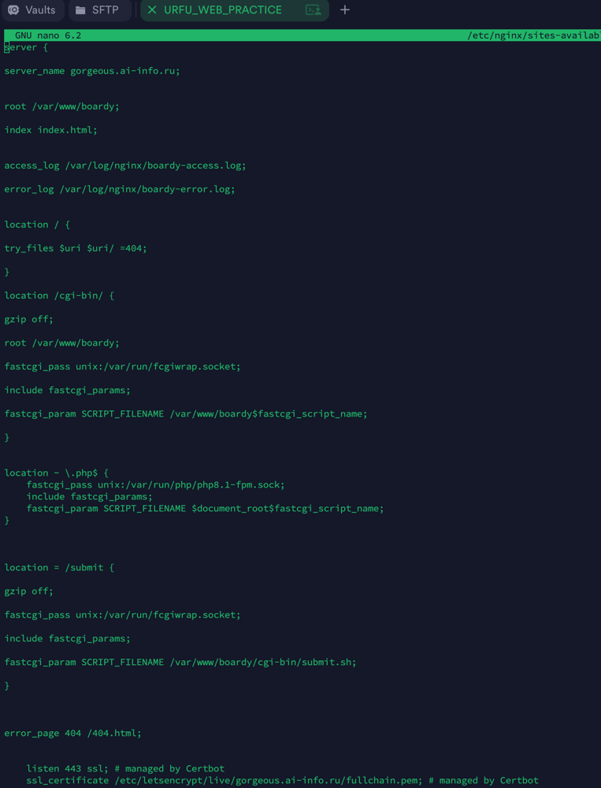

fcgiwrap - это надстройка, которая позволяет запускать cgi-скрипты через протокол FastCGI.
FastCGI - это приложение(php-fpm), которое запущено и слушает сокет. 

fcgiwrap: каждый раз нужно заново запускать процесс, чтоб выполнить скрипт. (инициализировать ядро, конфиги php и так далее),
php-fpm: это уже запущенное приложение с несколькими воркерами

### 4. Shared nothing
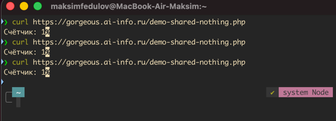

Счетчик не растет, потому что переменная $counter не живет между запросами. Каждый раз она заново инициализируется. 
shared nothing - тип архитектуры, когда каждый сервер или запрос живет независимо, имеет собственный ресурсы, память, данные

### 5. Блокировка воркеров
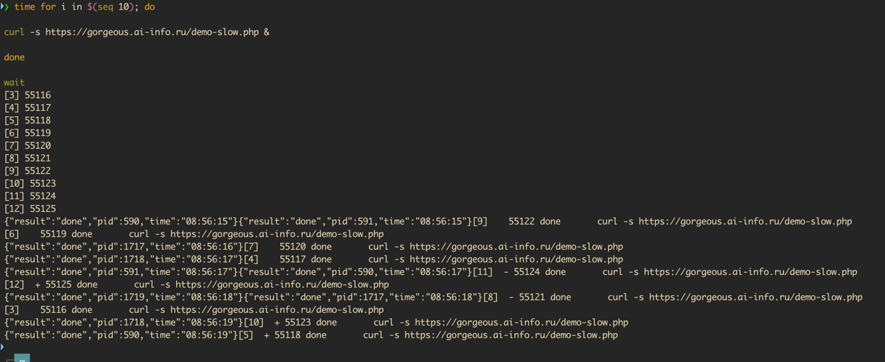
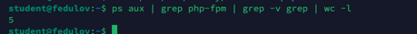

Выполнение заняло примерно 4-5 секунд. 5 воркеров. 
Общее время выполнения зависит от кол-ва запросов, количества воркеров и времени выполнения одного запроса.

### 6. Установка и приложение
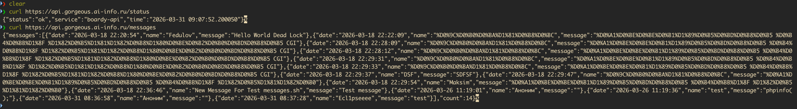

### 7. Живой процесс (счётчик)
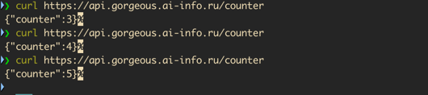
Здесь счетчик растет, потому что переменная couner инициализированна в рамках всего приложения, а не одной страницы.

### 8. Async: 10 запросов за 2 секунды
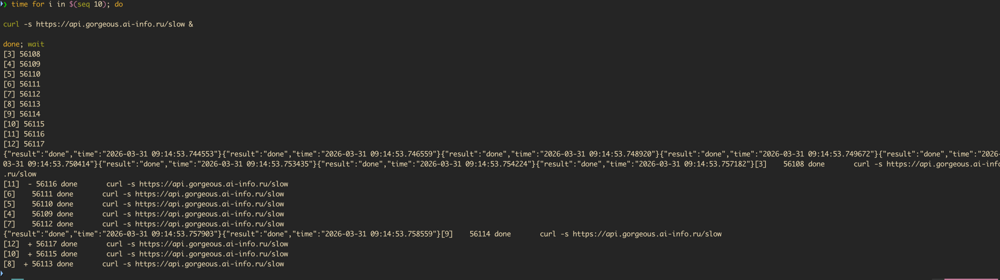
Потому что здесь используется event loop, а не php-fpm. Поэтому, когда мы доходим до asyncio, то event loop берет другой запрос, пока этот ждет 2 секунды. php-fpm ждал бы окончания запроса и потом только берет следующий.

### 9. Блокирующий код убивает event loop
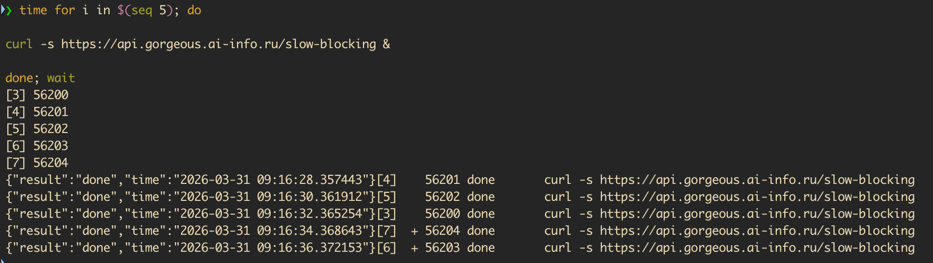
time.sleep - блокирующее ожидание, оно замораживает весь процесс python. Event loop тоже останавливается.
asyncio.sleep - не блокирующее ожидание, управление отдается event loop

### 10. Swagger
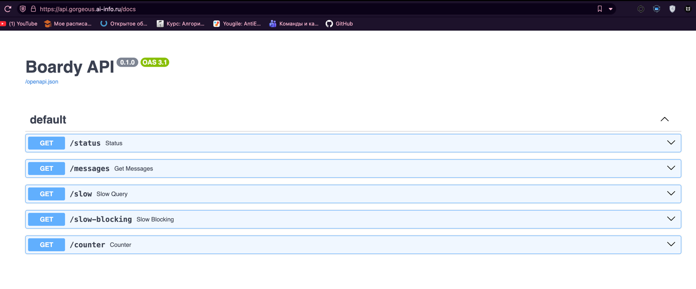

### 11. systemd-сервис
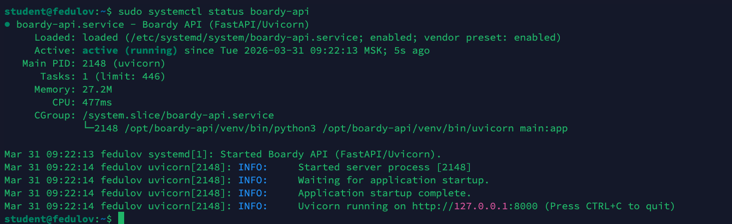

### 12. Nginx proxy_pass
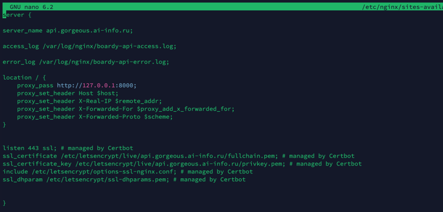
proxy_pass - nginx работает как reverse proxy. Он передает http запрос и пересылает его к другому веб-серверу. Gunicorn, Unicorn или другой nginx.
fastcgi_pass - nginx сам обрабатывает http запрос и отдает компактный бинарный формат fastcgi, прежде чем отправить его в php-fpm

php не самостоятельный веб-сервер и ему нужен такой посредник.
Для запуска python кода используются сервера приложений. Это полноценные веб-сервера. NGINX нужен доя обработки статики, ssl и так далее.

### 13. Два формата
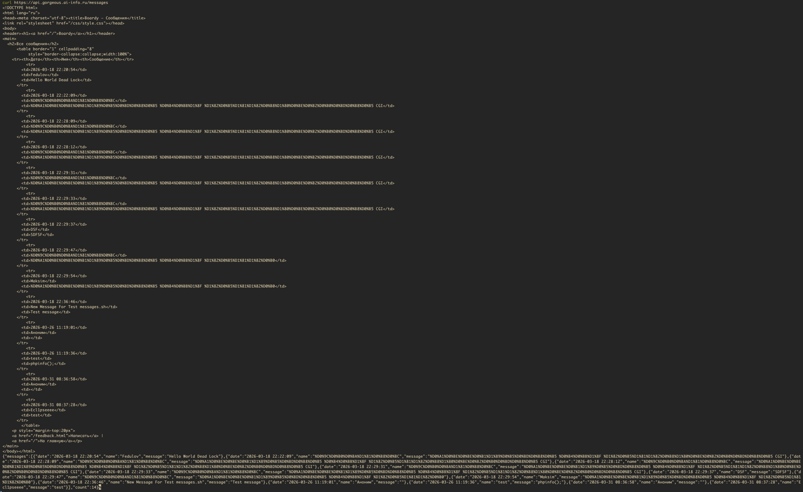
html нужен для браузера, чтоб "красиво" отобразить пользователю нужную информацию.
json нужен для api, чтоб можно было получать только конкретные и нужные данные другим разработчикам или сервисам.

### 14. Процессы
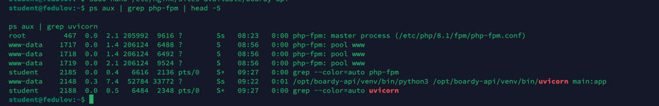