# Отчет по лабораторной работе №8

### 1. Установка MySQL
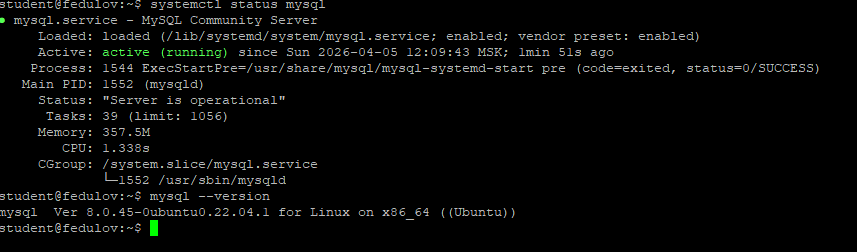

### 2. База данных и пользователь
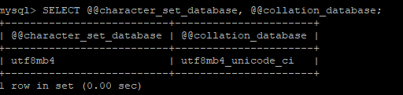

**Теоретические вопросы:**
* **Почему utf8mb4, а не utf8?** utf8mb4 - полный Unicode. Он содержит все языки и эмодзи. utf8 - только BMP. Он содержит буквы, цифры, знаки, но нет эмодзи. utf8 в mysql - костыль, который поддерживает 3 байта (нет эмодзи).
* **Что такое collation и зачем unicode_ci?** Collation нужен для сравнения и сортировки. Unicode_ci - точное сравнение по Unicode правилам. К примеру, при поиске ё = е. 

### 3. phpMyAdmin
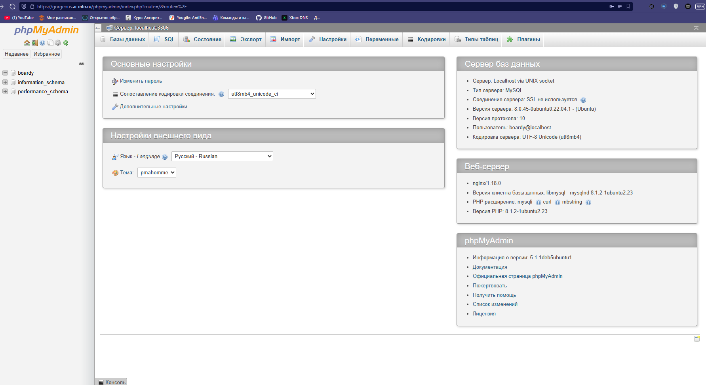

### 4. Три таблицы (users, posts, comments)
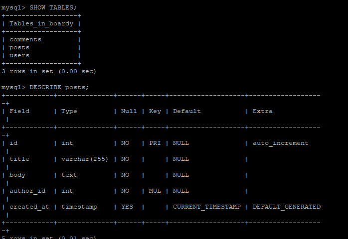


**Теоретические вопросы:**
* **Что такое FOREIGN KEY и ON DELETE CASCADE? Зачем они нужны?**
  FOREIGN KEY - это поле, которое ссылается на PK в другой таблице. ON DELETE CASCADE - это правило удаления, благодаря которому при удалении записи из главной таблицы автоматически удаляет другие записи, которые привязаны к этой
* **Какой движок (storage engine) используется и почему?** InnoDB. Нужен ACID, нужны Foreign Key, нужны строковые блокировки

### 5. SQL-скрипт создания схемы
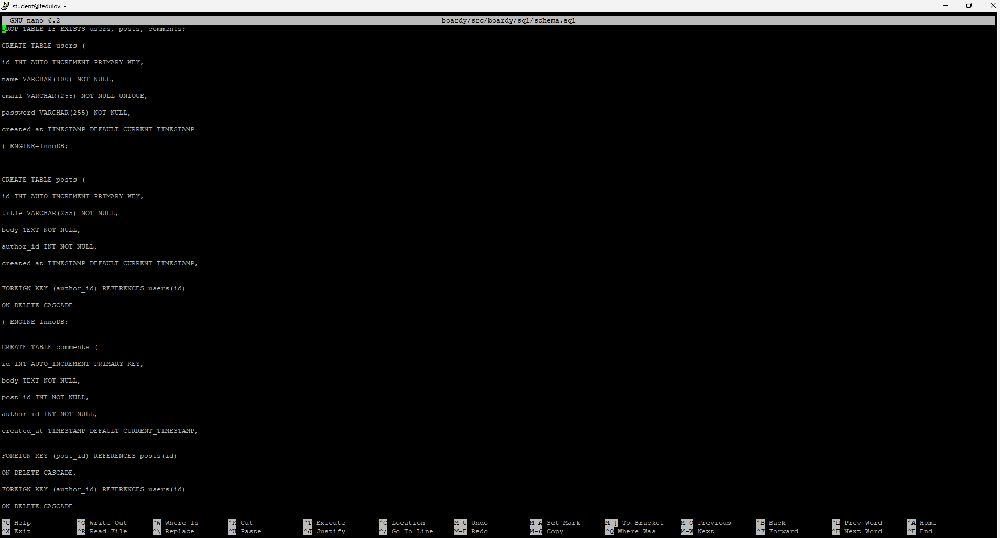

### 6. Заполнение данными (INSERT)
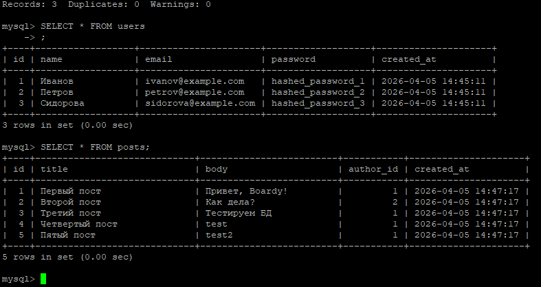
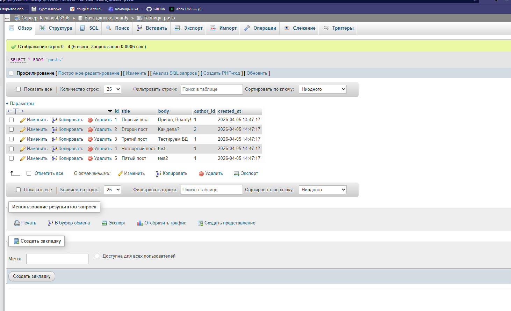

### 7. Выборка данных с JOIN
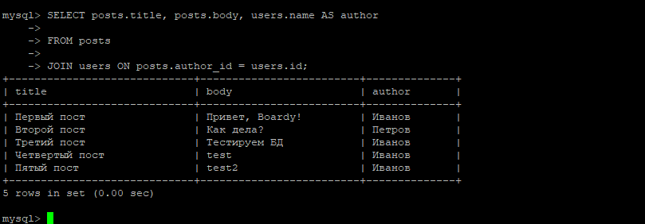

**Теоретические вопросы:**
* **Зачем нужен JOIN?**
    JOIN нужен для объединения таблиц на основе связанного между ними столбца
* **Как получить имя автора без использования JOIN?**
```sql
SELECT posts.title, posts.body, users.name AS author
FROM posts, users
WHERE posts.author_id = users.id;
```

### 8. Проверка целостности (Foreign Key Error)
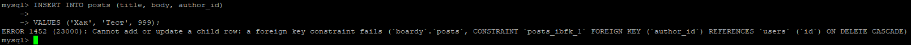

### 9. Проверка каскадного удаления (CASCADE)
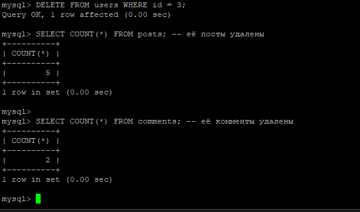

### 10. Демонстрация SQL-инъекции
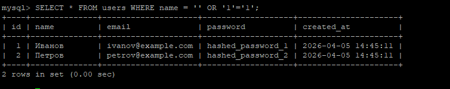

**Теоретические вопросы:**
* **Как работает SQL-инъекция?** Какие-то данные или информацию, которые мы ожидаем получить от пользователя, превращаются в команды для БД
* **Как Prepared Statement (подготовленные выражения) защищают от этой атаки?** Процесс разделяется на 2 этапа:
1. Сервер отправляет БД скелет запроса с "?". БД компилирует структуру запроса и ожидает текст.
2. Сервер отправляет только значения для этого запроса.

### 11. Подключение к БД (db.php)
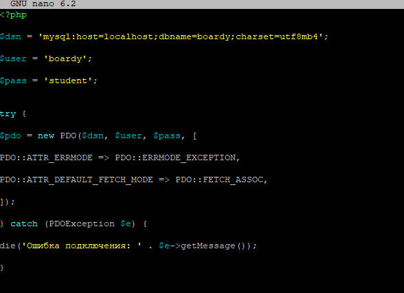

### 12. Отправка формы через MySQL (submit.php)

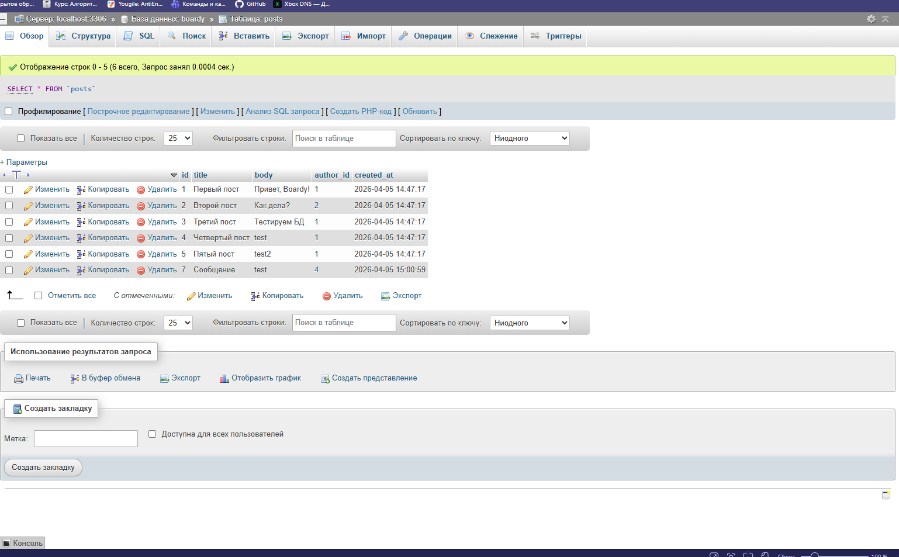

### 13. Вывод сообщений из MySQL (messages.php)
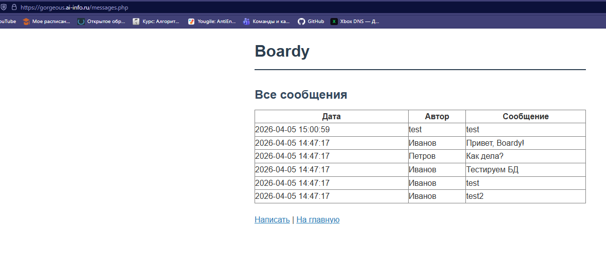

### 14. FastAPI + MySQL (aiomysql)
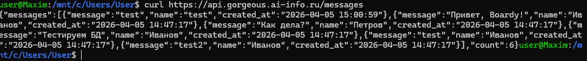
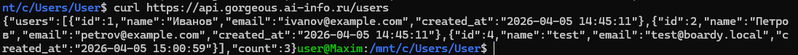

**Теоретические вопросы:**
* **Почему используется aiomysql, а не обычный mysql-connector?**
  aimysql является асинхронным. Когда мы используем await, о программа может заниматься другими запросами. С обычным синхронным драйвером все стоит на паузе, пока мы ждем ответ.
* **Что произойдет с event loop при использовании синхронного драйвера в асинхронном коде?**
  Случится блокировка. Асинхронный сервис превращается в однопоточный. Появятся задержки и тайм-ауты
