# Отчет по лабораторной работе №9

## Часть A. REST API

### 1. Структура проекта
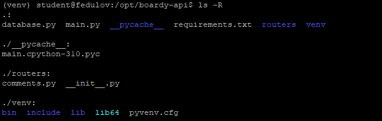

### 2. GET — список комментариев
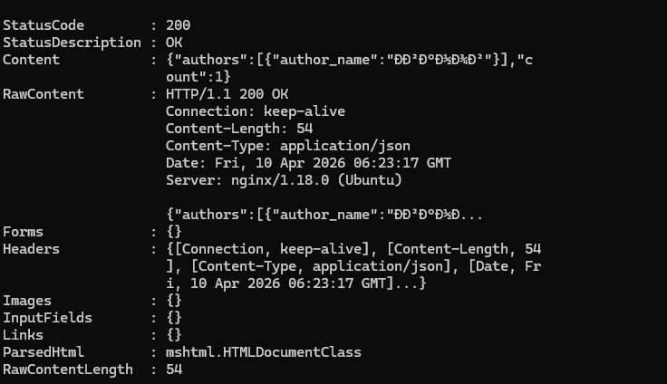

* **Какой SQL-запрос выполняет этот эндпоинт?**
```python
await cur.execute(
    'SELECT u.name AS author_name '
    'FROM comments c '
    'JOIN users u ON c.author_id = u.id '
    'WHERE c.post_id = %s '
    'ORDER BY c.created_at',
    (post_id,)
)
```
* **Зачем JOIN?** Чтоб найти связи между автором постов и автором комментария

### 3. POST — создать комментарий
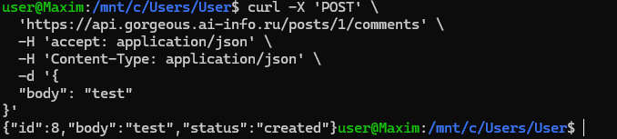

* **Почему 201, а не 200?** 201 => запрос успешно выполнен и был создан новый объект. 200 => запрос был выполнен успешно
* **Что означает Content-Type: application/json?** Значит, что серверу была отправлена информация в формате json

### 4. PUT — редактировать
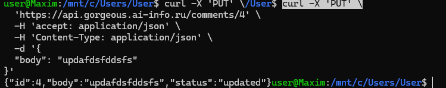

* **Чем PUT отличается от POST?** POST (не идемпотентный) - полностью создает новый объект. PUT(идемпотентный)- изменяет какие-то поля в уже созданном объекте
* **Почему URL другой (/comments/{id}, а не /posts/{id}/comments)?** Потому что у комментариев всегда есть id свой, который не зависит от post. Поэтому нет смысла передавть post_id в запросе

### 5. DELETE — удалить
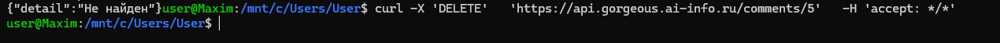

* **Перечислите 4 HTTP-глагола. Какой код ответа у каждого и почему?**
GET - 200 (Запрос выполнен успешно) Чтение
POST - 201 (Новый ресурс был успешно создан) Создание
PUT - 200 (Изменено) Полное обновление
DELETE - 204(тк нечего отправлять назад в теле запроса) Удаление

### 6. Ошибки
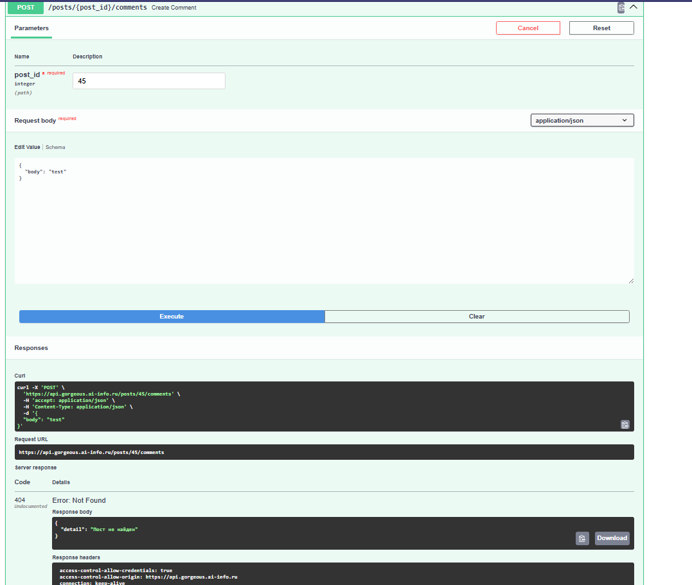
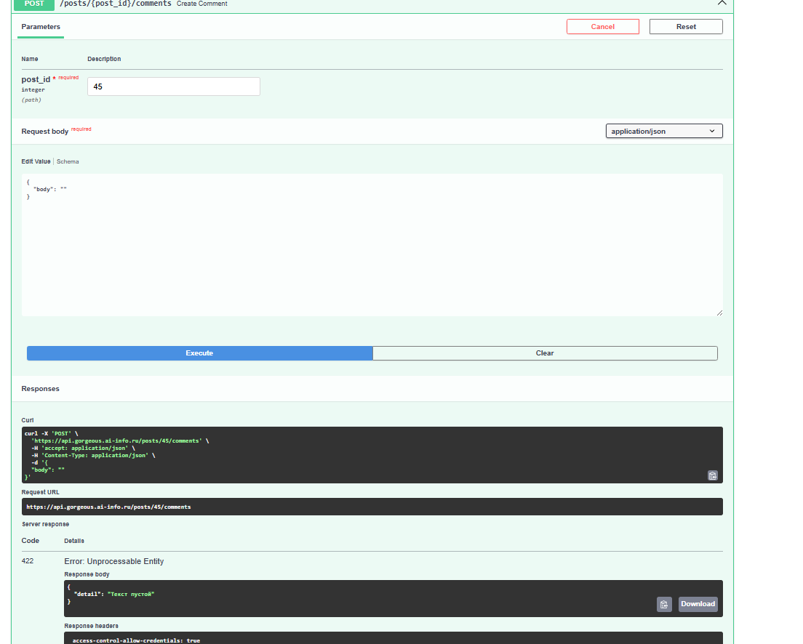

* **Чем 404 отличается от 422?**
404 - объект не найден
422 - необрабатываемая сущность(пустое поле в нашем случае)

### 7. Swagger
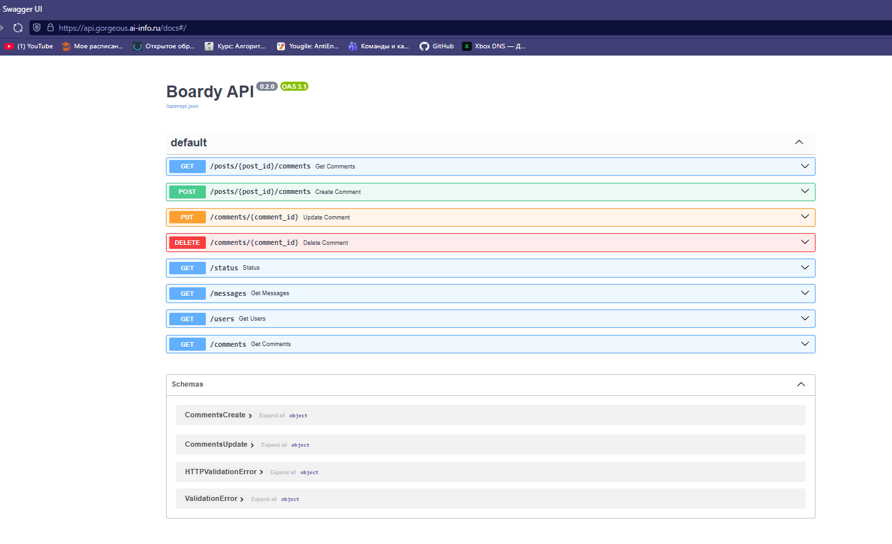


## Часть B. JavaScript-клиенты

### 8. Vanilla JS — демо
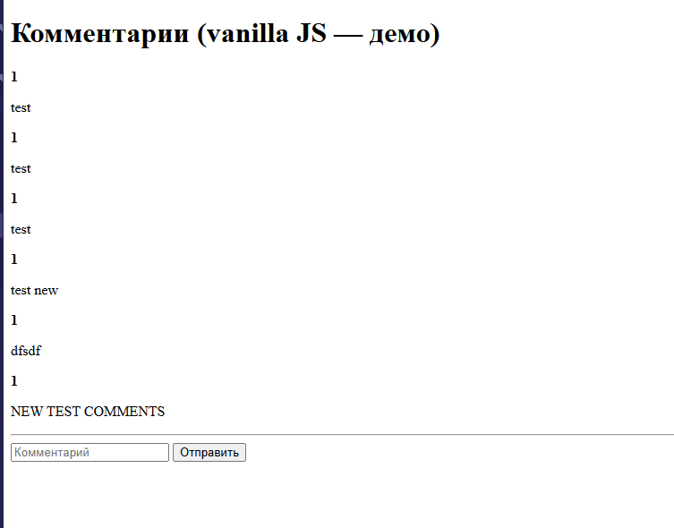

* **Что делает функция esc()?** Функция отвечает за безопасность и превращает опасные скобки < > в безобидные &lt; &gt;
* **Что случится если её не вызвать?** Без нее при XSS-атаке у всех пользователей будет выходить ошибка

### 9. React — полный CRUD
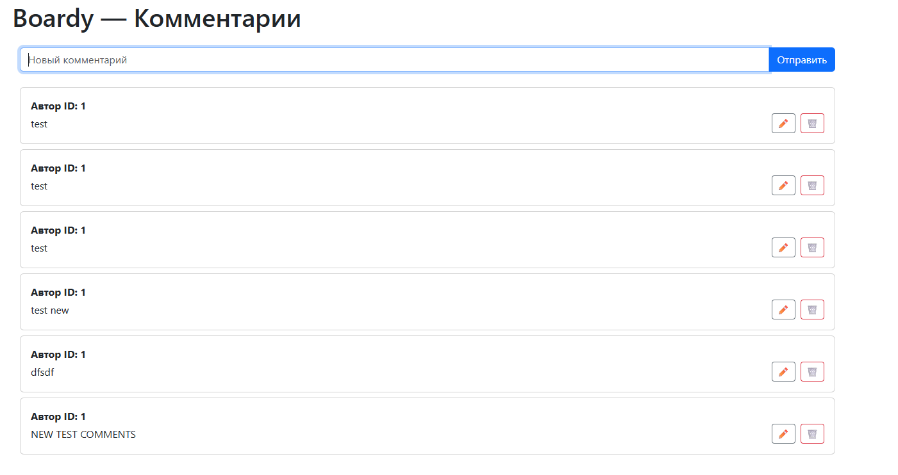
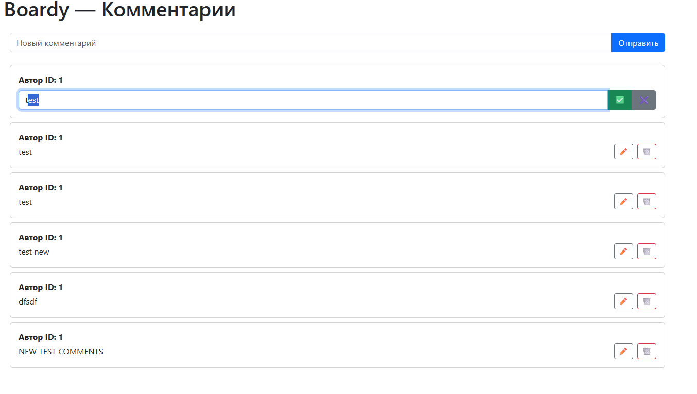
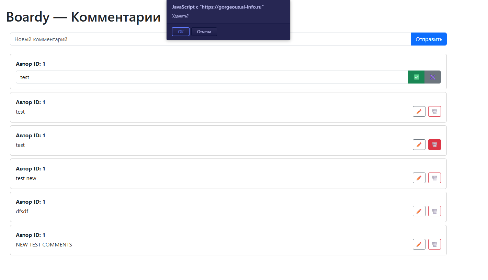

### 10. Сравнение кода
**Где хранится состояние (список комментариев, текст формы)?**
Vanila JS: Состояние размазано по DOM-структуре. Список комментариев хранится в виде HTML-узлов.
React: Состояние хранится в памяти JavaScript
**Как обновляется список после добавления?**
Vanila JS: Сначала перехватываем событие отправки, создаем новые елементы через document.createElement, наполняем их, ищем родительский контейнер и применяем appendChild
React: Объявляем массив в состоянни
**Как реализовано редактирование?**
Vanila JS: Ищем элемент в DOM по id, добавляем обработчики событий, а после сохранения - вручную обновить текст в DOM
React: Проверяется флаг isEditing. true - компонент возвращает форму, false - текст
**Как защищаемся от XSS?**
Vanila JS: Ответственность на разработчике
React: Защита встроена по умолчанию. Значения в фигурных скобках экранируются по умолчанию.

### 11. DevTools → Network
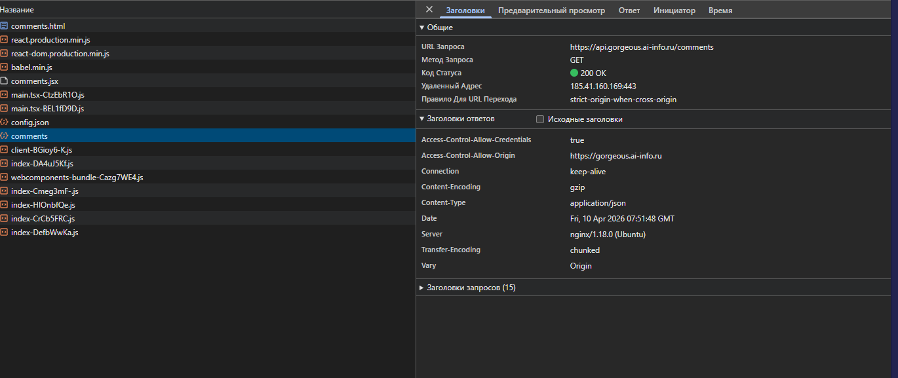

* **Сколько запросов?** 16
* **Какой из них — к API?** Выделенный запрос. comments


## Часть C. SSR vs CSR

### 12. View Source
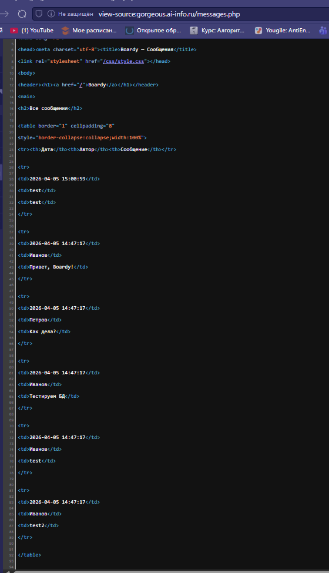
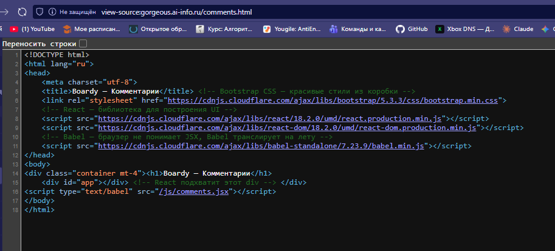

* **Почему в CSR нет данных в исходнике?** Браузер сначала скачивает пустой HTML, потом JS-файлы, исполняет их, только после этого JavaScript отправляет запросы к API и рисует данные внутри пустого контейнера
* **Что увидит поисковый бот?** Простые боты не исполняют Js и для них страница будет абсолютно пустой, продвинутые боты могут исполнять JavaScript

### 13. XSS
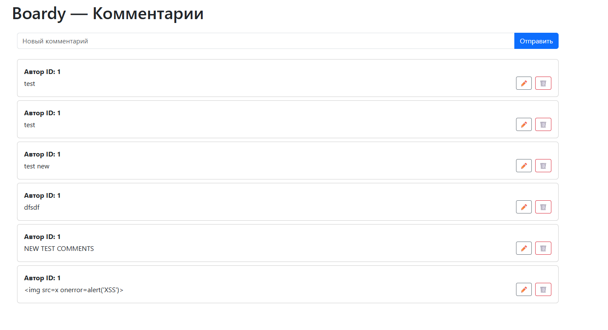


* **Как vanilla JS и React защищаются от XSS?** 
Vanila JS: Здесь нет встроенного «щита». Безопасность зависит от того, какой метод манипуляции DOM выберет программист:
React: Когда вы пишете {userContent}, React перед вставкой в DOM преобразует все потенциально опасные символы в HTML-сущности.
* **Какой способ надёжнее?** React

### 14. Итоговая таблица 

| Параметр | SSR (PHP)          | vanilla JS       | React                  |
| :--- |:-------------------|:-----------------|:-----------------------|
| Кто рендерит HTML | сервер             | браузер          | браузер                |
| Формат ответа сервера | html               | пустой html + js | пустой html + js бандл |
| View Source: данные видны | да                 | нет              | нет                    |
| Перезагрузка при отправке | да                 | нет              | нет                    |
| Защита от XSS | на стороне сервера | ручная           | автоматическая         |
| Сложность кода | низкая/средняя     | высокая          | средняя                |

